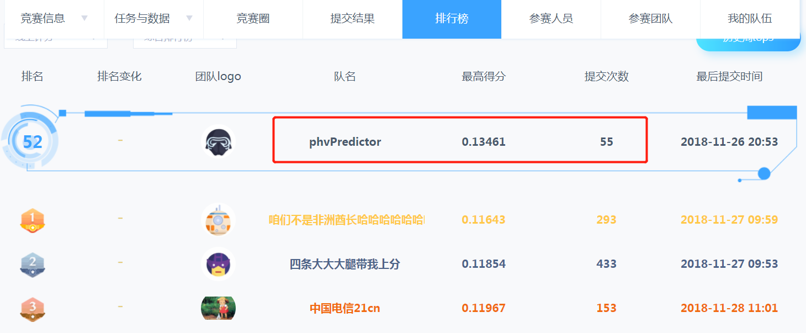

光伏短期功率预测大赛
================
李家翔,武睿琦,靳晓松
2022-03-10

<!-- README.md is generated from README.Rmd. Please edit that file -->

更新记录见 [NEWS](NEWS.md)

1.  比赛: 光伏短期功率预测大赛
2.  需求: 短期光伏功率预测
3.  项目名称的由来，PHotoVoltaic (phv)
4.  国能日新光伏功率预测大赛
    [**官方网址**](http://www.dcjingsai.com/common/cmpt/%E5%9B%BD%E8%83%BD%E6%97%A5%E6%96%B0%E5%85%89%E4%BC%8F%E5%8A%9F%E7%8E%87%E9%A2%84%E6%B5%8B%E5%A4%A7%E8%B5%9B_%E7%AB%9E%E8%B5%9B%E4%BF%A1%E6%81%AF.html)

此次比赛我们的名字最后排在**52**名。

<!-- -->

### 实现方式

我们主要的实现方式是

1.  神经网络模型，具体见Python代码`wushen.ipynb`。**最后成绩是神经网络模型的结果**。
2.  Xgboost的融合，具体见R代码`note.Rmd`

### EDA

使用`trelliscope`，交互方便，但是不适合上线部署，不便于交流。

1.  [trelliscope/p](https://jiaxiangbu.github.io/phv//trelliscope/p/index.html)
2.  [trelliscope/tsi](https://jiaxiangbu.github.io/phv//trelliscope/tsi/index.html)
3.  [trelliscope/tsi_real](https://jiaxiangbu.github.io/phv//trelliscope/tsi_real/index.html)

### 特征工程

我们尝试的特征工程是

1.  加入滞后项
2.  **加入时间相关变量，见R包`timetk::tk_augment_timeseries_signature`函数**
3.  **加入平方项、立方项，拟合非线性关系**
4.  加入交互项
5.  加入比率
6.  加入滚动SMA
7.  加入滚动方差
8.  **加入PCA的主成分**
9.  加入实发辐射的测试集预测值
10. 加入NMF的衍生变量
11. 加入 [prophet](https://github.com/facebook/prophet)

高亮为测试后效果好的变量。

一系列的特征工程我们在Xgboost进行了融合。

### 后续可以做的空间

#### XGBoost

1.  我们没有将神经网络和XGboost进行融合，因为没有保存训练集的预测值。
    主办方在比赛过程中修改了数据集和评价函数，导致我们无法复现原来的历史预测。
    **这是我们下一次比赛需要注意的问题**。
2.  采用更加合理的窗口特征提取方式(Elsayed et al. 2021)
3.  预测y的目标是四个，可以考虑多任务的框架，如 MT-GBT(Ying et al. 2022)

#### EDA和特征工程

1.  其次，我们一开始没有很好的做EDA，观察被解释变量关于时间的波动，查看异常值。
2.  在特征工程的部分，非线性关系的拟合，没有使用更高效的 Ramsey’s RESET
    test，详见[Github](https://github.com/JiaxiangBU/learn_fe)
3.  另外参考
    [预测值迁移](https://jiaxiangbu.github.io/channel_valuation/about)
    的问题，有可能存在
    [欠拟合](https://jiaxiangbu.github.io/learn_fe/)的情况，目前处理的方式见
    [模型校正部分](https://jiaxiangbu.github.io/train_model/learning_notes.html)
    。
4.  这里有四个光伏板，并且都是时间序列，所以算 longitudinal
    data，这里可以采用 LSTM 进行训练，参考 [6
    神经网络应用](https://jiaxiangbu.github.io/learn_longitudinal_analysis/analysis/introduction-panel-data.html)
5.  既然考虑了 PCA 作为聚类特征，那么应该考虑 DTW(Salvador and Chan
    2007; Izakian, Pedrycz, and Jamal 2015) 和 TS-PCA(Chang, Guo, and
    Yao 2018)
6.  既然考虑了 prophet，应该使用prophet的NNs训练(Triebe et al. 2021)

------------------------------------------------------------------------

<h4 align="center">
**Code of Conduct**
</h4>
<h6 align="center">
Please note that the ‘phv’ project is released with a [Contributor Code
of Conduct](CODE_OF_CONDUCT.md). By contributing to this project, you
agree to abide by its terms.
</h6>
<h4 align="center">
**License**
</h4>
<h6 align="center">
MIT © [Jiaxiang Li;Ruiqi Wu;Xiaosong Jin](LICENSE.md)
</h6>

Chang, Jinyuan, Bin Guo, and Qiwei Yao. 2018. “Principal Component
Analysis for Second-Order Stationary Vector Time Series.” *The Annals of
Statistics* 46 (5). <https://doi.org/10.1214/17-aos1613>.

Elsayed, Shereen, Daniela Thyssens, Ahmed Rashed, Hadi Samer Jomaa, and
Lars Schmidt-Thieme. 2021. “Do We Really Need Deep Learning Models for
Time Series Forecasting?” *arXiv Preprint arXiv:2101.02118*.

Izakian, Hesam, Witold Pedrycz, and Iqbal Jamal. 2015. “Fuzzy Clustering
of Time Series Data Using Dynamic Time Warping Distance.” *Engineering
Applications of Artificial Intelligence* 39: 235–44.

Salvador, Stan, and Philip Chan. 2007. “Toward Accurate Dynamic Time
Warping in Linear Time and Space.” *Intelligent Data Analysis* 11 (5):
561–80.

Triebe, Oskar, Hansika Hewamalage, Polina Pilyugina, Nikolay Laptev,
Christoph Bergmeir, and Ram Rajagopal. 2021. “NeuralProphet: Explainable
Forecasting at Scale.” <https://arxiv.org/abs/2111.15397>.

Ying, ZhenZhe, Zhuoer Xu, Weiqiang Wang, and Changhua Meng. 2022.
“MT-GBM: A Multi-Task Gradient Boosting Machine with Shared Decision
Trees.” *arXiv Preprint arXiv:2201.06239*.

