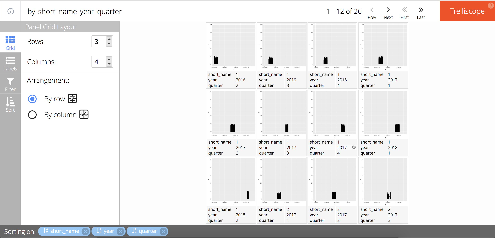

```{r setup,include=FALSE,warning = FALSE, message = FALSE}
knitr::opts_chunk$set(warning = FALSE, message = FALSE, echo=T)
library(tidyverse)
library(data.table)
library(xgboost)
```

```{r eval=FALSE, include=FALSE}
file.copy(
    file.path('/Users/vija/Downloads/180805_folder_01/tmp_jli/trans/projIn/phv'
              ,'note.html')
    ,file.path('/Users/vija/Downloads/180805_folder_01/tmp_jli/blog_180802/static/slides/phv')
    ,overwrite = T
    )
```

1. 比赛: 光伏短期功率预测大赛
1. 需求: 短期光伏功率预测
1. 项目名称的由来，PHotoVoltaic (phv)
1. 国能日新光伏功率预测大赛 [**官方网址**](http://www.dcjingsai.com/common/cmpt/%E5%9B%BD%E8%83%BD%E6%97%A5%E6%96%B0%E5%85%89%E4%BC%8F%E5%8A%9F%E7%8E%87%E9%A2%84%E6%B5%8B%E5%A4%A7%E8%B5%9B_%E7%AB%9E%E8%B5%9B%E4%BF%A1%E6%81%AF.html)
1. **更新**
    1. tweedie 回归，见 \@ref(tweedie)
    1. 调整排版，fold部分细节。
    1. 增加使用它`reprex`反馈代码的方式，见 \@ref(reprex)
    1. 下掉失去实际意义的函数和代码。
    1. $\surd$自定义损失函数
    : 我感觉就是MAE啊，因为没有改变权重啊。
    : `demo(topic = 'custom_objective',package = 'xgboost')`
        这是demo
    1. $\surd$用平均数
    1. $\surd$直接乘以倍数。
    : 如果异常值出现两极化，应该要慎重，会导致预测值处于中间，对一部分值预测低，一部分预测高。


```{r}
model_log <- 
    fread(
        file.path('data','model_log','20181110_model_log.csv')
        ,encoding = 'UTF-8'
    )
```

```{r}
model_log
```

# EDA

## 录入 train 数据

```{r eval=F}
data_path <- file.path('data','data_trans','data201810311047')
train_data_0 <- 
    data.table(
        short_name = 
            data_path %>% 
            list.files(full.names = F) %>% 
            str_subset('train_[:digit:].csv')
        ,full_name = 
            data_path %>% 
            list.files(full.names = T) %>% 
            str_subset('train_[:digit:].csv')
    ) %>% 
    mutate(
        data = map(full_name,fread,encoding='UTF-8')
    ) %>% 
    select(short_name,data) %>% 
    unnest()
```

```{r eval=F}
library(lubridate)
train_data_1 <- 
    train_data_0 %>% 
    mutate(short_name = str_extract_all(short_name,'_[:digit:]+') %>% str_remove('_') %>% as.integer) %>% 
    # tag 发电站
    set_names(
        'short_name'
        ,'t','tsi','weedspeed','winddirection','temperature','pressure','humidity','tsi_real','p'
    ) %>% 
    # rename
    mutate(t = round_date(ymd_hms(t),unit = 'minute')) %>% 
    # distinct(minute(t))
    # 时间有误差，清洗
    write_excel_csv(
        file.path(
            'data'
            ,paste(today() %>% str_remove_all('-') %>% str_sub(3,-1),'jiaxiang_traindata.csv',sep='_')
        )
    )
```

```{r}
library(lubridate)
train_data_1 <- 
    fread(file.path(
        'data'
        ,list.files('data') %>% str_subset('jiaxiang_traindata.csv') %>% max
    )
    ,encoding = 'UTF-8'
    ) %>% 
    mutate(t=ymd_hms(t))
    # convert t
```

## 录入 test 数据

```{r eval=F}
test_data_0 <- 
    data.table(
        short_name = 
            data_path %>% 
            list.files(full.names = F) %>% 
            str_subset('test_[:digit:].csv')
        ,full_name = 
            data_path %>% 
            list.files(full.names = T) %>% 
            str_subset('test_[:digit:].csv')
    ) %>% 
    mutate(
        data = map(full_name,fread,encoding='UTF-8')
    ) %>% 
    select(short_name,data) %>% 
    unnest()
```

```{r eval=F}
library(lubridate)
test_data_1 <- 
    test_data_0 %>% 
    mutate(short_name = str_extract_all(short_name,'_[:digit:]+') %>% str_remove('_') %>% as.integer) %>% 
    # tag 发电站
    set_names(
        'short_name','id'
        ,'t','tsi','weedspeed','winddirection','temperature','pressure','humidity'
    ) %>% 
    # rename
    mutate(t = round_date(ymd_hms(t),unit = 'minute')) %>% 
    # distinct(minute(t))
    # 时间有误差，清洗
    write_excel_csv(
        file.path(
            'data'
            ,paste(today() %>% str_remove_all('-') %>% str_sub(3,-1),'jiaxiang_testdata.csv',sep='_')
        )
    )
```

```{r}
library(lubridate)
test_data_1 <- 
    fread(file.path(
        'data'
        ,list.files('data') %>% str_subset('jiaxiang_testdata.csv') %>% max
    )
    ,encoding = 'UTF-8'
    ) %>% 
    mutate(t=ymd_hms(t))
    # convert t
```

## train 和 test 合并

这一步处理，主要是为了衍生 lag、sma、var变量。

```{r}
bind_data <- 
    bind_rows(
        train_data_1 %>% 
            mutate(is_train = TRUE)
        ,test_data_1 %>% 
            mutate(is_train = FALSE)
    )
```

```{r}
bind_data %>% 
    group_by(is_train,short_name) %>% 
    nest() %>% 
    mutate(text = map(data,~distinct(.,minute(t)) %>% str_flatten(collapse=','))) %>% 
    select(-data) %>% 
    unnest()
```

1. 时间清洗好了，每个subset每小时四个点。

```{r}
bind_data %>% 
    group_by(short_name,is_train) %>% 
    summarise(
        min(t),max(t)
        ,n()
    )
```

1. 数据表征

<details close>

<summary>特征工程。</summary>

## ~~add arima~~

时间间隔采用 15 min，具体见 \@ref(15min)。

p 的预测值。

```{r eval=F}
library(forecast)
library(lubridate)
bind_data_edittime <-   
    bind_data %>% 
    group_by(short_name,t,is_train) %>% 
    summarise_all(mean)
arima_mod <- 
    bind_data_edittime %>% 
    ungroup %>% 
    # 删除时间太近的重复值
    group_by(short_name,is_train) %>% 
    # count
    arrange(t) %>% 
    select(t,p) %>% 
    # filter(is_train==TRUE) %>% 
    nest %>% 
    spread(is_train,data) %>% 
    mutate(arima_mod = map(`TRUE`,~(auto.arima(.$p)))) %>% 
    mutate(range = map(`FALSE`,count))
```

`Error: Can't create call to non-callable object` 报错，因此不run。

```{r eval=F}
bind_data_edittime %>% 
    head
```

1. `bind_data_edittime`是清洗了时间的数据集，合并了`train`和`test`。

```{r eval=F}
p_pred_test <- 
    arima_mod %>% 
    unnest(range) %>% 
    mutate(pred = map2(.x = arima_mod
                       ,.y = n
                       ,.f = ~forecast(object = .x,h=.y) %>% 
                           as.data.frame
                       )) %>% 
    mutate(t_test = map(`FALSE`
                   ,~select(.,t) %>% 
                       mutate(t = round_date(t,unit = 'minute')) %>% 
                       distinct(t)
                   )) %>% 
    select(short_name,t_test,pred) %>% 
    unnest()
    # anyNA
```

```{r eval=F}
p_pred_train <- 
    arima_mod %>% 
    unnest(range) %>% 
    mutate(train = map(arima_mod
                       ,~fitted(object = .) %>%
                           as.data.frame
                       )) %>%
    mutate(t_train = map(`TRUE`
                   ,~select(.,t) %>%
                       mutate(t = round_date(t,unit = 'minute')) %>%
                       distinct(t)
                   )) %>%
    select(short_name,t_train,train) %>% 
    unnest()
    # anyNA
```

```{r eval=F}
arima_yhat_data <- 
    bind_rows(
        p_pred_train %>% 
            select(1:3) %>% 
            set_names(c('short_name','t','arima_yhat')) %>% 
            mutate(is_train = TRUE)
        ,p_pred_test %>% 
            select(1:3) %>% 
            set_names(c('short_name','t','arima_yhat')) %>% 
            mutate(is_train = FALSE)
    )
train_data_2 <- 
    train_data_1 %>% 
    mutate(t_hour = round_date(t,unit = 'minute')) %>% 
    left_join(
        arima_yhat_data %>% 
            filter(is_train == TRUE)
        ,by = c('t_hour'='t','short_name')
    ) %>% 
    select(-t_hour,-is_train)
test_data_2 <- 
    test_data_1 %>% 
    mutate(t_hour = round_date(t,unit = 'minute')) %>% 
    left_join(
        arima_yhat_data %>% 
            filter(is_train == FALSE)
        ,by = c('t_hour'='t','short_name')
    ) %>% 
    select(-t_hour,-is_train)
```

其他变量可以全量找关系。


## add lag

```{r eval=F}
lag_data <- 
bind_data %>% 
    group_by(short_name,is_train) %>% 
    arrange(t) %>% 
    transmute(
        t = t
        # ,p_l1 = lag(p,4)
        # ,p_l2 = lag(p,4*24)
        # ,p_l3 = lag(p,4*24*7)
        # ,p_l4 = lag(p,4*24*30)
        # ,p_l5 = lag(p,4*24*90)
        # ,p_l6 = lag(p,4*24*180)
        # ,p_l7 = lag(p,4*24*360)

        ,tsi_l1 = lag(tsi,4)
        ,tsi_l2 = lag(tsi,4*24)
        ,tsi_l3 = lag(tsi,4*24*7)
        ,tsi_l4 = lag(tsi,4*24*30)
        ,tsi_l5 = lag(tsi,4*24*90)
        ,tsi_l6 = lag(tsi,4*24*180)
        ,tsi_l7 = lag(tsi,4*24*360)
    ) %>% 
    write_excel_csv(
        file.path(
            'data'
            ,paste(now() %>% str_remove_all('-|\\s|:'),'jiaxiang_lagdata.csv',sep='_')
        )
    )
```


## add t

```{r eval=F}
library(timetk)
train_data_3 <- 
    train_data_1 %>% 
    # mutate(year = year(t)
    #        ,month = month(t)
    #        ,week = week(t)
    #        ,hour = hour(t)
    #        ,minute = minute(t)
    #        )
    group_by(short_name) %>% 
    arrange(t) %>% 
    tk_augment_timeseries_signature() %>% 
    mutate_if(is.ordered,as.integer)
test_data_3 <- 
    test_data_1 %>% 
    # mutate(year = year(t)
    #        ,month = month(t)
    #        ,week = week(t)
    #        ,hour = hour(t)
    #        ,minute = minute(t)
    #        )
    group_by(short_name) %>% 
    arrange(t) %>% 
    tk_augment_timeseries_signature() %>% 
    mutate_if(is.ordered,as.integer)
    # 有中文不能识别。
```


## add sq {#addsq}

```{r eval=F}
train_data_3.0 <- 
    train_data_3 %>% 
    mutate(tsi_2 = tsi^2
           ,weedspeed_2 = weedspeed^2
           ,winddirection_2 = winddirection^2
           ,temperature_2 = temperature^2
           ,pressure_2 = pressure^2
           ,humidity_2 = humidity^2
           
           ,tsi_3 = tsi^3
           ,weedspeed_3 = weedspeed^3
           ,winddirection_3 = winddirection^3
           ,temperature_3 = temperature^3
           ,pressure_3 = pressure^3
           ,humidity_3 = humidity^3
           )
    # na_if(-1)
    # 显然自动处理NA，不好
test_data_3.0 <- 
    test_data_3 %>% 
    mutate(tsi_2 = tsi^2
           ,weedspeed_2 = weedspeed^2
           ,winddirection_2 = winddirection^2
           ,temperature_2 = temperature^2
           ,pressure_2 = pressure^2
           ,humidity_2 = humidity^2

           ,tsi_3 = tsi^3
           ,weedspeed_3 = weedspeed^3
           ,winddirection_3 = winddirection^3
           ,temperature_3 = temperature^3
           ,pressure_3 = pressure^3
           ,humidity_3 = humidity^3
           )
```

## add interaction

```{r eval=F}
train_data_1 %>% 
  names()
```

```{r eval=F}
train_data_4 <- 
    train_data_3.0 %>% 
    mutate(mix_11 = weedspeed*winddirection
           ,mix_12 = weedspeed*temperature
           ,mix_13 = weedspeed*pressure
           ,mix_14 = weedspeed*humidity
           ,mix_15 = weedspeed*tsi

           ,mix_21 = winddirection*temperature
           ,mix_22 = winddirection*pressure
           ,mix_23 = winddirection*humidity
           ,mix_24 = winddirection*tsi

           ,mix_31 = temperature*pressure
           ,mix_32 = temperature*humidity
           ,mix_33 = temperature*tsi

           ,mix_41 = pressure*humidity
           ,mix_42 = pressure*tsi
           
           ,mix_51 = humidity*tsi
           
           ,mx1_11 = weedspeed*winddirection*temperature
           ,mx1_12 = weedspeed*winddirection*pressure
           ,mx1_13 = weedspeed*winddirection*humidity
           ,mx1_14 = weedspeed*winddirection*tsi
           
           ,mx1_21 = weedspeed*temperature*pressure
           ,mx1_22 = weedspeed*temperature*humidity
           ,mx1_23 = weedspeed*temperature*tsi
           
           ,mx1_31 = weedspeed*pressure*humidity
           ,mx1_32 = weedspeed*pressure*tsi
           
           ,mx1_41 = weedspeed*humidity*tsi
           
           ,mx2_11 = weedspeed*winddirection*temperature*pressure
           ,mx2_12 = weedspeed*winddirection*temperature*humidity
           ,mx2_13 = weedspeed*winddirection*temperature*tsi
           
           ,mx2_21 = weedspeed*winddirection*pressure*humidity
           ,mx2_22 = weedspeed*winddirection*pressure*tsi
           
           ,mx2_31 = weedspeed*winddirection*humidity*tsi
           
           
           ,mx3_11 = weedspeed*winddirection*temperature*pressure*humidity
           ,mx3_12 = weedspeed*winddirection*temperature*pressure*tsi
           
           ,mx3_21 = weedspeed*winddirection*pressure*humidity*tsi
           
           ,mx4_11 = weedspeed*winddirection*temperature*pressure*humidity*tsi
           )
    # na_if(-1)
    # 显然自动处理NA，不好
test_data_4 <- 
    test_data_3.0 %>% 
    mutate(mix_11 = weedspeed*winddirection
           ,mix_12 = weedspeed*temperature
           ,mix_13 = weedspeed*pressure
           ,mix_14 = weedspeed*humidity
           ,mix_15 = weedspeed*tsi

           ,mix_21 = winddirection*temperature
           ,mix_22 = winddirection*pressure
           ,mix_23 = winddirection*humidity
           ,mix_24 = winddirection*tsi

           ,mix_31 = temperature*pressure
           ,mix_32 = temperature*humidity
           ,mix_33 = temperature*tsi

           ,mix_41 = pressure*humidity
           ,mix_42 = pressure*tsi
           
           ,mix_51 = humidity*tsi
           
           ,mx1_11 = weedspeed*winddirection*temperature
           ,mx1_12 = weedspeed*winddirection*pressure
           ,mx1_13 = weedspeed*winddirection*humidity
           ,mx1_14 = weedspeed*winddirection*tsi
           
           ,mx1_21 = weedspeed*temperature*pressure
           ,mx1_22 = weedspeed*temperature*humidity
           ,mx1_23 = weedspeed*temperature*tsi
           
           ,mx1_31 = weedspeed*pressure*humidity
           ,mx1_32 = weedspeed*pressure*tsi
           
           ,mx1_41 = weedspeed*humidity*tsi
           
           ,mx2_11 = weedspeed*winddirection*temperature*pressure
           ,mx2_12 = weedspeed*winddirection*temperature*humidity
           ,mx2_13 = weedspeed*winddirection*temperature*tsi
           
           ,mx2_21 = weedspeed*winddirection*pressure*humidity
           ,mx2_22 = weedspeed*winddirection*pressure*tsi
           
           ,mx2_31 = weedspeed*winddirection*humidity*tsi
           
           
           ,mx3_11 = weedspeed*winddirection*temperature*pressure*humidity
           ,mx3_12 = weedspeed*winddirection*temperature*pressure*tsi
           
           ,mx3_21 = weedspeed*winddirection*pressure*humidity*tsi
           
           ,mx4_11 = weedspeed*winddirection*temperature*pressure*humidity*tsi
           )
```


## add ratio

```{r eval=F}
train_data_5 <- 
    train_data_3.0 %>% 
    mutate(rt_1 = tsi/weedspeed
           ,rt_2 = tsi/winddirection
           ,rt_3 = tsi/temperature
           ,rt_4 = tsi/pressure
           ,rt_5 = tsi/humidity
    ) %>% 
    mutate(rtc_1 = weedspeed/tsi
           ,rtc_2 = winddirection/tsi
           ,rtc_3 = temperature/tsi
           ,rtc_4 = pressure/tsi
           ,rtc_5 = humidity/tsi
    )
test_data_5 <- 
    test_data_3.0 %>% 
    mutate(rt_1 = tsi/weedspeed
           ,rt_2 = tsi/winddirection
           ,rt_3 = tsi/temperature
           ,rt_4 = tsi/pressure
           ,rt_5 = tsi/humidity
    ) %>% 
    mutate(rtc_1 = weedspeed/tsi
           ,rtc_2 = winddirection/tsi
           ,rtc_3 = temperature/tsi
           ,rtc_4 = pressure/tsi
           ,rtc_5 = humidity/tsi
    )
```


## add rolling sma

具体参考见

1. [tidyquant 使用技巧](https://jiaxiangli.netlify.com/2018/04/tidyquant/)
1. [tibbletime 使用技巧](https://jiaxiangli.netlify.com/2018/04/tibbletime/)

```{r eval=F}
library(tidyquant)
library(tibbletime)
tq_transmute_fun_options()
```
 
```{r eval=F}
library(glue)
sma_data <- 
bind_data %>% 
    select(short_name,t,tsi) %>% 
    group_by(short_name) %>% 
    as_tbl_time(index = t) %>% 
    # head(40000) %>% 

    tq_mutate(select = tsi,mutate_fun = SMA,n = 4,col_rename = 'tsi_sma_1') %>% 
    tq_mutate(select = tsi,mutate_fun = SMA,n = 4*24,col_rename = 'tsi_sma_2') %>% 
    tq_mutate(select = tsi,mutate_fun = SMA,n = 4*24*30,col_rename = 'tsi_sma_3') %>% 
    tq_mutate(select = tsi,mutate_fun = SMA,n = 4*24*90,col_rename = 'tsi_sma_4') %>% 
    tq_mutate(select = tsi,mutate_fun = SMA,n = 4*24*180,col_rename = 'tsi_sma_5') %>% 
    # tq_mutate(select = tsi,mutate_fun = SMA,n = 4*24*360,col_rename = 'tsi_sma_6')
    select(-tsi)
```

```{r eval=F}
sma_data %>% 
    write_excel_csv(
        file.path(
            'data'
            ,paste(now() %>% str_remove_all('-|\\s|:'),'jiaxiang_smadata.csv',sep='_')
        )
    )    
```


## add rolling runVar

具体参考见

1. [tidyquant 使用技巧](https://jiaxiangli.netlify.com/2018/04/tidyquant/)
1. [tibbletime 使用技巧](https://jiaxiangli.netlify.com/2018/04/tibbletime/)

```{r eval=F}
library(tidyquant)
library(tibbletime)
tq_transmute_fun_options()
```
 
```{r eval=F}
library(glue)
runVar_data <- 
bind_data %>% 
    select(short_name,t,tsi) %>% 
    group_by(short_name) %>% 
    as_tbl_time(index = t) %>% 
    # head(40000) %>% 

    tq_mutate(select = tsi,mutate_fun = runVar,n = 4,col_rename = 'tsi_runVar_1') %>% 
    tq_mutate(select = tsi,mutate_fun = runVar,n = 4*24,col_rename = 'tsi_runVar_2') %>% 
    tq_mutate(select = tsi,mutate_fun = runVar,n = 4*24*30,col_rename = 'tsi_runVar_3') %>% 
    tq_mutate(select = tsi,mutate_fun = runVar,n = 4*24*90,col_rename = 'tsi_runVar_4') %>% 
    tq_mutate(select = tsi,mutate_fun = runVar,n = 4*24*180,col_rename = 'tsi_runVar_5') %>% 
    # tq_mutate(select = tsi,mutate_fun = runVar,n = 4*24*360,col_rename = 'tsi_runVar_6')
    select(-tsi)
```

```{r eval=F}
runVar_data %>% 
    write_excel_csv(
        file.path(
            'data'
            ,paste(now() %>% str_remove_all('-|\\s|:'),'jiaxiang_runVardata.csv',sep='_')
        )
    )    
```


# Model

## baseline xgboost tweedie

### d* data

```{r eval=F}
set.seed(123)
split <- sample(nrow(train_data_3.0),nrow(train_data_3.0)*0.8,replace = T)
train_data03.0 <- train_data_3.0[split,]
valid_data03.0 <- train_data_3.0[-split,]
dtrain03.0 <- xgb.DMatrix(data = as.matrix(train_data03.0 %>% select(-t,-tsi_real,-p)),
                      label = train_data03.0$p+100
                      # gamma 回归 y > 0
                        )
dvalid03.0 <- xgb.DMatrix(data = as.matrix(valid_data03.0 %>% select(-t,-tsi_real,-p)),
                      label = valid_data03.0$p+100
                        )
watchlist03.0 <- list(train=dtrain03.0,
                  valid=dvalid03.0
                  )
```

```{r eval=F}
library(lubridate)
xgb.DMatrix.save(
    dtrain03.0
    ,file.path(
        'data'
        ,paste(today() %>% str_remove_all('-') %>% str_sub(3,-1),'dtrain03.0.buffer',sep='_')
    )
)
xgb.DMatrix.save(
    dvalid03.0
    ,file.path(
        'data'
        ,paste(today() %>% str_remove_all('-') %>% str_sub(3,-1),'dvalid03.0.buffer',sep='_')
    )
)
```

```{r eval=F}
dtrain03.0 <- 
    xgb.DMatrix(
        file.path(
            'data'
            ,list.files('data') %>% str_subset('dtrain03.0.buffer') %>% max
        )
    )
dvalid03.0 <- 
    xgb.DMatrix(
        file.path(
            'data'
            ,list.files('data') %>% str_subset('dvalid03.0.buffer') %>% max
        )
    )
```

### param tuning

`expand.grid`函数实现穷举。

```{r eval=F}
eta <- 
    # c(0.1,0.2,0.3) # 0.1
    # c(0.1)
    # c(0.05,0.1,0.15)
    0.3
nround <- 
    200
max_depth <- 
    # c(5,7,10)
    # c(8,10,12)
    # c(9,10,11)
    11
    # c(4,5,6)
min_child_weight <- 
    # c(30,35,40)
    # c(37,40,43)
    # c(38,40,42)
    42
    # c(18,20,22)
    # c(17,18,19)
    # c(16,17)
gamma <- 
    # c(1,2,3)
    # c(2.5,3,3.5)
    # c(2.25,2.5,2.75)
    2.5
    # c(0.7,1.0,1.2)
    # c(0.6,0.65,0.7)
subsample <- 
    # c(0.3,0.5,0.7)
    c(0.6,0.7,0.8)
    # c(0.65,0.7,0.75)
colsample_bytree <- 
    # c(0.3,0.5,0.7)
    c(0.4,0.5,0.6)
    # c(0.6,0.7,0.8)
    # c(0.75,0.8,0.85)
    # c(0.825,0.85,0.875)
    # c(0.8725,0.875,0.8775)
    # c(0.87,0.8725,0.874)
    # c(0.86875,0.87,0.87125)
nfold <- 
    # c(5,10,15)
    # c(15,18,20)
    # c(16,18,19)
    # 18
    # c(20,25,30)
    30
hyper_grid <- 
    expand.grid(
        eta=eta,
        nround=nround,
        max_depth = max_depth,
        min_child_weight = min_child_weight,
        gamma = gamma,
        subsample = subsample,
        colsample_bytree = colsample_bytree,
        nfold = nfold
    )
hyper_grid
```

```{r eval=F}
xgb_hyper_grid <- 
    function(eta,nround,max_depth,min_child_weight,gamma,subsample,colsample_bytree,nfold){
        set.seed(123)
        xgb <- xgb.train(
         data=dtrain03.0,
         ## 1
           eta = eta,
           nround=nround,
         ## 2
           max_depth = max_depth,
           min_child_weight = min_child_weight,  
           gamma = gamma,
         ## 3
           subsample = subsample,
           colsample_bytree = colsample_bytree,
         ## 评价标准
           eval.metric = "rmse",
         ## objective
           objective = "reg:tweedie", ## 这是一个回归问题
         ## 其他
           seed = 123,
           watchlist=watchlist03.0,
           nfold = nfold,
           early_stopping_rounds = 50,
           nthread = 8
           )
        # data.table::data.table(
        #     best_score = xgb$best_score[1]
        #     ,best_iteration = xgb$best_iteration
        #     ,niter = xgb$niter
        bind_cols(
            xgb$evaluation_log %>% 
                dplyr::slice(c(xgb$best_iteration))
            ,xgb$params %>% 
                as.data.frame()
        )
        # 对比参数和结果，指导调整参数。
    }
```

1. 注意一定要重新跑`dmatrix`，不然会闪退。

```{r eval=F}
set.seed(123)
find_rmse <- 
    hyper_grid %>% 
    mutate(mod = pmap(
                      list(eta=eta
                           ,nround=nround
                           ,max_depth=max_depth
                           ,min_child_weight=min_child_weight
                           ,gamma=gamma
                           ,subsample=subsample
                           ,colsample_bytree=colsample_bytree
                           ,nfold=nfold
                           )
                      ,xgb_hyper_grid
                      )
               ) %>% 
    select(mod) %>% 
    unnest() %>% 
    write_excel_csv(
        file.path(
            'data'
            ,paste(now() %>% str_remove_all('-|\\s|:'),'xgboost_result_baseline_tweedie.csv',sep='_')
        )
    )
```

1. `tweedie`下降很快。

```{r eval=F}
find_rmse %>% 
    # filter(valid_rmse == min(valid_rmse))
    # arrange(valid_rmse-train_rmse)
    arrange(valid_rmse)
```

### model

```{r}
get_log_xgb <- function(x,start_time,end_time,output='xgboost_result_baseline_tweedie.csv'){
    # lose start_time or end_time
    # results
    # Error in .Call(`_dplyr_mutate_impl`, df, dots) : 
    #     promise already under evaluation: recursive default argument reference or earlier problems?
    xgb_parms <- x$params %>% 
        as.data.frame() 
    sys_name <- 
        Sys.info() %>% 
        t() %>% 
        as.data.frame() %>% 
        select(sysname)
    bind_cols(
        xgb_parms,sys_name
    ) %>%
        mutate(
            start_time = start_time
            ,end_time = end_time
        ) %>% 
    write_excel_csv(
        file.path(
            'data'
            ,paste(now() %>% str_remove_all('-|\\s|:'),'xgboost_result_baseline_tweedie.csv',sep='_')
        )
    )
}
```

```{r eval=F}
set.seed(123)
start_time <- now()
xgb_base05 <- xgb.train(
    data=dtrain03.0,
    ## 1
    eta = 0.3,
    nround=200,
    ## 2
    max_depth = 11,
    min_child_weight = 42,  
    gamma = 2.5,
    ## 3
    subsample = 0.8	,
    colsample_bytree = 0.6,
    ## 评价标准
    ## eval.metric = "error",
    eval.metric = "mae",
    eval.metric = "rmse",
    ## eval.metric = ks_value,
    ## eval.metric = "auc",
    ## eval.metric = "logloss",
    ## objective
    objective = "reg:tweedie", ## 这是一个回归问题
    ## 其他
    seed = 123,
    watchlist=watchlist03.0,
    nfold = 30,
    early_stopping_rounds = 50,
    nthread = 8
    )
end_time <- now()
get_log_xgb(xgb_base05,start_time,end_time)
```

```{r eval=F}
xgb.save(
    xgb_base05
    ,file.path(
        'data'
        ,paste(today() %>% str_remove_all('-') %>% str_sub(3,-1),'xgb_base05.model',sep='_')
    )
)
```

```{r eval=F}
xgb_base05 <- 
    xgb.load(
        file.path(
            'data'
            ,list.files('data') %>% str_subset('xgb_base05.model') %>% max
        )
    )
```

### predict

```{r eval=F}
test_data_3.0 %>% 
    ungroup %>% 
    # unless
    # Error in mutate_impl(.data, dots) : Column `predicition` must be length 11808 (the group size) or one, not 46571
    select(id) %>% 
    mutate(
        predicition = 
            # 我也是醉了，prediction
            test_data_3.0 %>% 
            select(-id,-t) %>% 
            as.matrix %>% 
            predict(xgb_base05,.) %>% 
            `-`(100)
            # length()
            # 46571
            # round(.,1)
    ) %>% 
    write_excel_csv(
        file.path(
            'data'
            ,paste(today() %>% str_remove_all('-') %>% str_sub(3,-1),'jiaxiang_prediction_xgboostbaseline_tweedie.csv',sep='_')
        )
    )
```

没有提升了，下一步做lag变量。


### imp

```{r eval=F}
xgb.importance(feature_names = colnames(dtrain03.0), model = xgb_base05) %>% 
    write_excel_csv(
        file.path(
            'data'
            ,paste(today() %>% str_remove_all('-') %>% str_sub(3,-1),'jiaxiang_imp_tbl.csv',sep='_')
        )
    ) 
```

```{r eval=F}
fread(file.path(
    'data'
    ,list.files('data') %>% str_subset('jiaxiang_imp_tbl.csv') %>% max
)
,encoding = 'UTF-8'
)
```

### 总结


## baseline xgboost tweedie delete underc data

```{r}
drop_data_underc <- function(x){
    # x %>% 
    train_data_3.0 %>% 
    mutate(
        c = case_when(
            short_name == 1 ~ 10
            ,short_name == 2 ~ 10
            ,short_name == 3 ~ 40
            ,short_name == 4 ~ 50
        )
        # 装机功率
    ) %>% 
    filter(p >= c*0.03) %>% 
    # 实际功率值大于等于Ci*0.03
    select(-c)
}
```

```{r eval=F}
train_data_3.0_underc <- drop_data_underc(train_data_3.0)
```

### d* data

```{r eval=F}
set.seed(123)
split <- sample(nrow(train_data_3.0_underc),nrow(train_data_3.0_underc)*0.8,replace = T)
train_data03.0underc <- train_data_3.0_underc[split,]
valid_data03.0underc <- train_data_3.0_underc[-split,]
dtrain03.0underc <- xgb.DMatrix(data = as.matrix(train_data03.0underc %>% select(-t,-tsi_real,-p)),
                      label = train_data03.0underc$p+100
                      # gamma 回归 y > 0
                        )
dvalid03.0underc <- xgb.DMatrix(data = as.matrix(valid_data03.0underc %>% select(-t,-tsi_real,-p)),
                      label = valid_data03.0underc$p+100
                        )
watchlist03.0underc <- list(train=dtrain03.0underc,
                  valid=dvalid03.0underc
                  )
```

```{r eval=F}
library(lubridate)
xgb.DMatrix.save(
    dtrain03.0underc
    ,file.path(
        'data'
        ,paste(today() %>% str_remove_all('-') %>% str_sub(3,-1),'dtrain03.0underc.buffer',sep='_')
    )
)
xgb.DMatrix.save(
    dvalid03.0underc
    ,file.path(
        'data'
        ,paste(today() %>% str_remove_all('-') %>% str_sub(3,-1),'dvalid03.0underc.buffer',sep='_')
    )
)
```

```{r eval=F}
dtrain03.0underc <- 
    xgb.DMatrix(
        file.path(
            'data'
            ,list.files('data') %>% str_subset('dtrain03.0underc.buffer') %>% max
        )
    )
dvalid03.0underc <- 
    xgb.DMatrix(
        file.path(
            'data'
            ,list.files('data') %>% str_subset('dvalid03.0underc.buffer') %>% max
        )
    )
```

### param tuning

`expand.grid`函数实现穷举。

```{r eval=F}
eta <- 
    # c(0.1,0.2,0.3) # 0.1
    # c(0.1)
    # c(0.05,0.1,0.15)
    0.3
nround <- 
    200
max_depth <- 
    # c(5,7,10)
    # c(8,10,12)
    # c(9,10,11)
    11
    # c(4,5,6)
min_child_weight <- 
    # c(30,35,40)
    # c(37,40,43)
    # c(38,40,42)
    42
    # c(18,20,22)
    # c(17,18,19)
    # c(16,17)
gamma <- 
    # c(1,2,3)
    # c(2.5,3,3.5)
    # c(2.25,2.5,2.75)
    2.5
    # c(0.7,1.0,1.2)
    # c(0.6,0.65,0.7)
subsample <- 
    # c(0.3,0.5,0.7)
    c(0.6,0.7,0.8)
    # c(0.65,0.7,0.75)
colsample_bytree <- 
    # c(0.3,0.5,0.7)
    c(0.4,0.5,0.6)
    # c(0.6,0.7,0.8)
    # c(0.75,0.8,0.85)
    # c(0.825,0.85,0.875)
    # c(0.8725,0.875,0.8775)
    # c(0.87,0.8725,0.874)
    # c(0.86875,0.87,0.87125)
nfold <- 
    # c(5,10,15)
    # c(15,18,20)
    # c(16,18,19)
    # 18
    # c(20,25,30)
    30
hyper_grid <- 
    expand.grid(
        eta=eta,
        nround=nround,
        max_depth = max_depth,
        min_child_weight = min_child_weight,
        gamma = gamma,
        subsample = subsample,
        colsample_bytree = colsample_bytree,
        nfold = nfold
    )
hyper_grid
```

```{r eval=F}
xgb_hyper_grid <- 
    function(eta,nround,max_depth,min_child_weight,gamma,subsample,colsample_bytree,nfold){
        set.seed(123)
        xgb <- xgb.train(
         data=dtrain03.0underc,
         ## 1
           eta = eta,
           nround=nround,
         ## 2
           max_depth = max_depth,
           min_child_weight = min_child_weight,  
           gamma = gamma,
         ## 3
           subsample = subsample,
           colsample_bytree = colsample_bytree,
         ## 评价标准
           eval.metric = "rmse",
         ## objective
           objective = "reg:tweedie", ## 这是一个回归问题
         ## 其他
           seed = 123,
           watchlist=watchlist03.0underc,
           nfold = nfold,
           early_stopping_rounds = 50,
           nthread = 8
           )
        # data.table::data.table(
        #     best_score = xgb$best_score[1]
        #     ,best_iteration = xgb$best_iteration
        #     ,niter = xgb$niter
        bind_cols(
            xgb$evaluation_log %>% 
                dplyr::slice(c(xgb$best_iteration))
            ,xgb$params %>% 
                as.data.frame()
        )
        # 对比参数和结果，指导调整参数。
    }
```

1. 注意一定要重新跑`dmatrix`，不然会闪退。

```{r eval=F}
set.seed(123)
find_rmse <- 
    hyper_grid %>% 
    mutate(mod = pmap(
                      list(eta=eta
                           ,nround=nround
                           ,max_depth=max_depth
                           ,min_child_weight=min_child_weight
                           ,gamma=gamma
                           ,subsample=subsample
                           ,colsample_bytree=colsample_bytree
                           ,nfold=nfold
                           )
                      ,xgb_hyper_grid
                      )
               ) %>% 
    select(mod) %>% 
    unnest() %>% 
    write_excel_csv(
        file.path(
            'data'
            ,paste(now() %>% str_remove_all('-|\\s|:'),'xgboost_result_baseline_tweedie.csv',sep='_')
        )
    )
```

1. `tweedie`下降很快。

```{r eval=F}
find_rmse %>% 
    # filter(valid_rmse == min(valid_rmse))
    # arrange(valid_rmse-train_rmse)
    arrange(valid_rmse)
```

### model

```{r}
get_log_xgb <- function(x,start_time,end_time,output='xgboost_result_baseline_tweedie.csv'){
    # lose start_time or end_time
    # results
    # Error in .Call(`_dplyr_mutate_impl`, df, dots) : 
    #     promise already under evaluation: recursive default argument reference or earlier problems?
    xgb_parms <- x$params %>% 
        as.data.frame() 
    sys_name <- 
        Sys.info() %>% 
        t() %>% 
        as.data.frame() %>% 
        select(sysname)
    bind_cols(
        xgb_parms,sys_name
    ) %>%
        mutate(
            start_time = start_time
            ,end_time = end_time
        ) %>% 
    write_excel_csv(
        file.path(
            'data'
            ,paste(now() %>% str_remove_all('-|\\s|:'),'xgboost_result_baseline_tweedie.csv',sep='_')
        )
    )
}
```

```{r eval=F}
set.seed(123)
start_time <- now()
xgb_base05underc <- xgb.train(
    data=dtrain03.0underc,
    ## 1
    eta = 0.3,
    nround=200,
    ## 2
    max_depth = 11,
    min_child_weight = 42,  
    gamma = 2.5,
    ## 3
    subsample = 0.8	,
    colsample_bytree = 0.6,
    ## 评价标准
    ## eval.metric = "error",
    eval.metric = "mae",
    eval.metric = "rmse",
    ## eval.metric = ks_value,
    ## eval.metric = "auc",
    ## eval.metric = "logloss",
    ## objective
    objective = "reg:tweedie", ## 这是一个回归问题
    ## 其他
    seed = 123,
    watchlist=watchlist03.0underc,
    nfold = 30,
    early_stopping_rounds = 50,
    nthread = 8
    )
end_time <- now()
get_log_xgb(xgb_base05underc,start_time,end_time)
```

```{r eval=F}
xgb.save(
    xgb_base05underc
    ,file.path(
        'data'
        ,paste(today() %>% str_remove_all('-') %>% str_sub(3,-1),'xgb_base05underc.model',sep='_')
    )
)
```

```{r eval=F}
xgb_base05underc <- 
    xgb.load(
        file.path(
            'data'
            ,list.files('data') %>% str_subset('xgb_base05underc.model') %>% max
        )
    )
```

### predict

```{r eval=F}
setdiff(
    train_data_3.0_underc %>% select(-t,-tsi_real,-p) %>% names
    ,test_data_3.0 %>% select(-id,-t) %>% names
)
```


```{r eval=F}
test_data_3.0 %>% 
    ungroup %>% 
    # unless
    # Error in mutate_impl(.data, dots) : Column `predicition` must be length 11808 (the group size) or one, not 46571
    select(id) %>% 
    mutate(
        predicition = 
            # 我也是醉了，prediction
            test_data_3.0 %>% 
            select(-id,-t) %>% 
            as.matrix %>% 
            predict(xgb_base05underc,.) %>% 
            `-`(100)
            # length()
            # 46571
            # round(.,1)
    ) %>% 
    write_excel_csv(
        file.path(
            'data'
            ,paste(today() %>% str_remove_all('-') %>% str_sub(3,-1),'jiaxiang_prediction_xgboostbaseline_tweedie.csv',sep='_')
        )
    )
```

### imp

```{r eval=F}
xgb.importance(feature_names = colnames(dtrain03.0underc), model = xgb_base05underc) %>% 
    write_excel_csv(
        file.path(
            'data'
            ,paste(today() %>% str_remove_all('-') %>% str_sub(3,-1),'jiaxiang_imp_tbl.csv',sep='_')
        )
    ) 
```

```{r eval=F}
fread(file.path(
    'data'
    ,list.files('data') %>% str_subset('jiaxiang_imp_tbl.csv') %>% max
)
,encoding = 'UTF-8'
)
```

### 损失函数

```{r eval=F}
train_data_3.0_underc_train <- 
    train_data_3.0_underc %>% 
    ungroup %>% 
    # unless
    # Error in mutate_impl(.data, dots) : Column `predicition` must be length 11808 (the group size) or one, not 46571
    select(id,t,p) %>% 
    mutate(
        predicition = 
            # 我也是醉了，prediction
            train_data_3.0_underc %>% 
            select(
                setdiff(
                    test_data_3.0 %>% names
                    ,'id'
                )
                ) %>% 
            select(-t) %>% 
            as.matrix %>% 
            predict(xgb_base05underc,.) %>% 
            `-`(100)
            # length()
            # 46571
            # round(.,1)
    )
add2evaluation::phv_metric(
    train_data_3.0_underc_train$short_name
    ,train_data_3.0_underc_train$t
    ,train_data_3.0_underc_train$p
    ,train_data_3.0_underc_train$predicition)
```


### 总结


1. 官方的异常值剔除有意义。


## baseline xgboost tweedie delete underc_meanday data daily data y and x


```{r eval=F}
train_data_3.0_underc_meanday <- 
train_data_3.0_underc %>% 
    mutate(t = floor_date(t,unit = 'day')) %>% 
    group_by(short_name,t) %>% 
    summarise_all(mean)
test_data_3.0_underc_meanday <- 
test_data_3.0 %>% 
    select(id,short_name,t) %>% 
    mutate(t_on = floor_date(t,unit = 'day')) %>% 
    left_join(
        test_data_3.0 %>% 
        mutate(t = floor_date(t,unit = 'day')) %>% 
        group_by(short_name,t) %>% 
        summarise_all(mean) %>% 
        select(-id)
        ,by=c('short_name'='short_name','t_on'='t')
    ) %>% 
    select(-t_on) %>% 
    ungroup()
```

### d* data

```{r eval=F}
set.seed(123)
split <- sample(nrow(train_data_3.0_underc_meanday),nrow(train_data_3.0_underc_meanday)*0.8,replace = T)
train_data03.0underc_meanday <- train_data_3.0_underc_meanday[split,]
valid_data03.0underc_meanday <- train_data_3.0_underc_meanday[-split,]
dtrain03.0underc_meanday <- xgb.DMatrix(data = as.matrix(train_data03.0underc_meanday %>% select(-t,-tsi_real,-p)),
                      label = train_data03.0underc_meanday$p+100
                      # gamma 回归 y > 0
                        )
dvalid03.0underc_meanday <- xgb.DMatrix(data = as.matrix(valid_data03.0underc_meanday %>% select(-t,-tsi_real,-p)),
                      label = valid_data03.0underc_meanday$p+100
                        )
watchlist03.0underc_meanday <- list(train=dtrain03.0underc_meanday,
                  valid=dvalid03.0underc_meanday
                  )
```

```{r eval=F}
library(lubridate)
xgb.DMatrix.save(
    dtrain03.0underc_meanday
    ,file.path(
        'data'
        ,paste(today() %>% str_remove_all('-') %>% str_sub(3,-1),'dtrain03.0underc_meanday.buffer',sep='_')
    )
)
xgb.DMatrix.save(
    dvalid03.0underc_meanday
    ,file.path(
        'data'
        ,paste(today() %>% str_remove_all('-') %>% str_sub(3,-1),'dvalid03.0underc_meanday.buffer',sep='_')
    )
)
```

```{r eval=F}
dtrain03.0underc_meanday <- 
    xgb.DMatrix(
        file.path(
            'data'
            ,list.files('data') %>% str_subset('dtrain03.0underc_meanday.buffer') %>% max
        )
    )
dvalid03.0underc_meanday <- 
    xgb.DMatrix(
        file.path(
            'data'
            ,list.files('data') %>% str_subset('dvalid03.0underc_meanday.buffer') %>% max
        )
    )
```

### model

```{r eval=F}
get_log_xgb <- function(x,start_time,end_time,output='xgboost_result_baseline_tweedie.csv'){
    # lose start_time or end_time
    # results
    # Error in .Call(`_dplyr_mutate_impl`, df, dots) : 
    #     promise already under evaluation: recursive default argument reference or earlier problems?
    xgb_parms <- x$params %>% 
        as.data.frame() 
    sys_name <- 
        Sys.info() %>% 
        t() %>% 
        as.data.frame() %>% 
        select(sysname)
    bind_cols(
        xgb_parms,sys_name
    ) %>%
        mutate(
            start_time = start_time
            ,end_time = end_time
        ) %>% 
    write_excel_csv(
        file.path(
            'data'
            ,paste(now() %>% str_remove_all('-|\\s|:'),'xgboost_result_baseline_tweedie.csv',sep='_')
        )
    )
}
```

```{r eval=F}
set.seed(123)
start_time <- now()
xgb_base05underc_meanday <- xgb.train(
    data=dtrain03.0underc_meanday,
    ## 1
    eta = 0.3,
    nround=200,
    ## 2
    max_depth = 11,
    min_child_weight = 42,  
    gamma = 2.5,
    ## 3
    subsample = 0.8	,
    colsample_bytree = 0.6,
    ## 评价标准
    ## eval.metric = "error",
    eval.metric = "mae",
    eval.metric = "rmse",
    ## eval.metric = ks_value,
    ## eval.metric = "auc",
    ## eval.metric = "logloss",
    ## objective
    objective = "reg:tweedie", ## 这是一个回归问题
    ## 其他
    seed = 123,
    watchlist=watchlist03.0underc_meanday,
    nfold = 30,
    early_stopping_rounds = 50,
    nthread = 8
    )
end_time <- now()
get_log_xgb(xgb_base05underc_meanday,start_time,end_time)
```

```{r eval=F}
xgb.save(
    xgb_base05underc_meanday
    ,file.path(
        'data'
        ,paste(today() %>% str_remove_all('-') %>% str_sub(3,-1),'xgb_base05underc_meanday.model',sep='_')
    )
)
```

```{r eval=F}
xgb_base05underc_meanday <- 
    xgb.load(
        file.path(
            'data'
            ,list.files('data') %>% str_subset('xgb_base05underc_meanday.model') %>% max
        )
    )
```

### predict

```{r eval=F}
setdiff(
    train_data_3.0_underc_meanday %>% select(-t,-tsi_real,-p) %>% names
    ,test_data_3.0 %>% select(-id,-t) %>% names
)
```


```{r eval=F}
test_data_3.0_underc_meanday %>% 
    ungroup %>% 
    # unless
    # Error in mutate_impl(.data, dots) : Column `predicition` must be length 11808 (the group size) or one, not 46571
    select(id) %>% 
    mutate(
        predicition = 
            # 我也是醉了，prediction
            test_data_3.0_underc_meanday %>% 
            select(-id,-t) %>% 
            as.matrix %>% 
            predict(xgb_base05underc_meanday,.) %>% 
            `-`(100)
            # length()
            # 46571
            # round(.,1)
    ) %>% 
    write_excel_csv(
        file.path(
            'data'
            ,paste(today() %>% str_remove_all('-') %>% str_sub(3,-1),'jiaxiang_prediction_xgboostbaseline_tweedie.csv',sep='_')
        )
    )
```

### imp

```{r eval=F}
xgb.importance(feature_names = colnames(dtrain03.0underc_meanday), model = xgb_base05underc_meanday) %>% 
    write_excel_csv(
        file.path(
            'data'
            ,paste(today() %>% str_remove_all('-') %>% str_sub(3,-1),'jiaxiang_imp_tbl.csv',sep='_')
        )
    ) 
```

```{r eval=F}
fread(file.path(
    'data'
    ,list.files('data') %>% str_subset('jiaxiang_imp_tbl.csv') %>% max
)
,encoding = 'UTF-8'
)
```

### 损失函数

```{r eval=F}
train_data_3.0_underc_meanday_train <- 
    train_data_3.0_underc_meanday %>% 
    ungroup %>% 
    # unless
    # Error in mutate_impl(.data, dots) : Column `predicition` must be length 11808 (the group size) or one, not 46571
    select(id,t,p) %>% 
    mutate(
        predicition = 
            # 我也是醉了，prediction
            train_data_3.0_underc_meanday %>% 
            select(
                setdiff(
                    test_data_3.0 %>% names
                    ,'id'
                )
                ) %>% 
            select(-t) %>% 
            as.matrix %>% 
            predict(xgb_base05underc_meanday,.) %>% 
            `-`(100)
            # length()
            # 46571
            # round(.,1)
    )
add2evaluation::phv_metric(
    train_data_3.0_underc_meanday_train$short_name
    ,train_data_3.0_underc_meanday_train$t
    ,train_data_3.0_underc_meanday_train$p
    ,train_data_3.0_underc_meanday_train$predicition)
```


### 总结


1. 官方的异常值剔除有意义。

## baseline xgboost tweedie delete underc_meanhour data daily data y and x add 15 min data

```{r eval=F}
train_data_3.0_underc_meanhour <- 
        
        train_data_3.0_underc %>% 
            mutate(t = floor_date(t,unit = 'hour')) %>% 
            group_by(short_name,t) %>% 
            summarise_all(mean) %>% 
            ungroup %>% 
    
        # 加上每刻钟的信息
        left_join(
            train_data_3.0_underc %>% 
                ungroup() %>% 
                filter(minute(t)==0) %>% 
                mutate(t = floor_date(t,unit = 'hour')) %>% 
                select(-p,-tsi_real) %>% 
                # set_names(paste0(names(.),'_00')) %>% 
                rename_at(vars(3:48),~paste0(.,'_00'))
            ,by=c('short_name','t')
        ) %>% 
        
        left_join(
            train_data_3.0_underc %>% 
                ungroup() %>% 
                filter(minute(t)==15) %>% 
                mutate(t = floor_date(t,unit = 'hour')) %>% 
                select(-p,-tsi_real) %>% 
                rename_at(vars(3:48),~paste0(.,'_15'))
            ,by=c('short_name','t')
        ) %>% 
        
        left_join(
            train_data_3.0_underc %>% 
                ungroup() %>% 
                filter(minute(t)==30) %>% 
                mutate(t = floor_date(t,unit = 'hour')) %>% 
                select(-p,-tsi_real) %>% 
                rename_at(vars(3:48),~paste0(.,'_30'))
            ,by=c('short_name','t')
        ) %>% 
        
        left_join(
            train_data_3.0_underc %>% 
                ungroup() %>% 
                filter(minute(t)==45) %>% 
                mutate(t = floor_date(t,unit = 'hour')) %>% 
                select(-p,-tsi_real) %>% 
                rename_at(vars(3:48),~paste0(.,'_45'))
            ,by=c('short_name','t')
        )
```

```{r eval=F}
test_data_3.0_meanhour <- 
    
        
        test_data_3.0 %>% 
            mutate(t = floor_date(t,unit = 'hour')) %>% 
            group_by(short_name,t) %>% 
            summarise_all(mean) %>% 
            ungroup %>% 
    
        # 加上每刻钟的信息
        left_join(
            test_data_3.0 %>% 
                ungroup() %>% 
                filter(minute(t)==0) %>% 
                mutate(t = floor_date(t,unit = 'hour')) %>% 
                select(-id) %>% 
                # set_names(paste0(names(.),'_00')) %>% 
                rename_at(vars(3:48),~paste0(.,'_00'))
            ,by=c('short_name','t')
        ) %>% 
        
        left_join(
            test_data_3.0 %>% 
                ungroup() %>% 
                filter(minute(t)==15) %>% 
                mutate(t = floor_date(t,unit = 'hour')) %>% 
                select(-id) %>% 
                rename_at(vars(3:48),~paste0(.,'_15'))
            ,by=c('short_name','t')
        ) %>% 
        
        left_join(
            test_data_3.0 %>% 
                ungroup() %>% 
                filter(minute(t)==30) %>% 
                mutate(t = floor_date(t,unit = 'hour')) %>% 
                select(-id) %>% 
                rename_at(vars(3:48),~paste0(.,'_30'))
            ,by=c('short_name','t')
        ) %>% 
        
        left_join(
            test_data_3.0 %>% 
                ungroup() %>% 
                filter(minute(t)==45) %>% 
                mutate(t = floor_date(t,unit = 'hour')) %>% 
                select(-id) %>% 
                rename_at(vars(3:48),~paste0(.,'_45'))
            ,by=c('short_name','t')
        )
```

### d* data

```{r eval=F}
set.seed(123)
split <- sample(nrow(train_data_3.0_underc_meanhour),nrow(train_data_3.0_underc_meanhour)*0.8,replace = T)
train_data03.0underc_meanhour <- train_data_3.0_underc_meanhour[split,]
valid_data03.0underc_meanhour <- train_data_3.0_underc_meanhour[-split,]
dtrain03.0underc_meanhour <- xgb.DMatrix(data = as.matrix(train_data03.0underc_meanhour %>% select(-t,-tsi_real,-p)),
                      label = train_data03.0underc_meanhour$p+100
                      # gamma 回归 y > 0
                        )
dvalid03.0underc_meanhour <- xgb.DMatrix(data = as.matrix(valid_data03.0underc_meanhour %>% select(-t,-tsi_real,-p)),
                      label = valid_data03.0underc_meanhour$p+100
                        )
watchlist03.0underc_meanhour <- list(train=dtrain03.0underc_meanhour,
                  valid=dvalid03.0underc_meanhour
                  )
```

```{r eval=F}
library(lubridate)
xgb.DMatrix.save(
    dtrain03.0underc_meanhour
    ,file.path(
        'data'
        ,paste(today() %>% str_remove_all('-') %>% str_sub(3,-1),'dtrain03.0underc_meanhour.buffer',sep='_')
    )
)
xgb.DMatrix.save(
    dvalid03.0underc_meanhour
    ,file.path(
        'data'
        ,paste(today() %>% str_remove_all('-') %>% str_sub(3,-1),'dvalid03.0underc_meanhour.buffer',sep='_')
    )
)
```

```{r eval=F}
dtrain03.0underc_meanhour <- 
    xgb.DMatrix(
        file.path(
            'data'
            ,list.files('data') %>% str_subset('dtrain03.0underc_meanhour.buffer') %>% max
        )
    )
dvalid03.0underc_meanhour <- 
    xgb.DMatrix(
        file.path(
            'data'
            ,list.files('data') %>% str_subset('dvalid03.0underc_meanhour.buffer') %>% max
        )
    )
```

### model

```{r eval=F}
get_log_xgb <- function(x,start_time,end_time,output='xgboost_result_baseline_tweedie.csv'){
    # lose start_time or end_time
    # results
    # Error in .Call(`_dplyr_mutate_impl`, df, dots) : 
    #     promise already under evaluation: recursive default argument reference or earlier problems?
    xgb_parms <- x$params %>% 
        as.data.frame() 
    sys_name <- 
        Sys.info() %>% 
        t() %>% 
        as.data.frame() %>% 
        select(sysname)
    bind_cols(
        xgb_parms,sys_name
    ) %>%
        mutate(
            start_time = start_time
            ,end_time = end_time
        ) %>% 
    write_excel_csv(
        file.path(
            'data'
            ,paste(now() %>% str_remove_all('-|\\s|:'),'xgboost_result_baseline_tweedie.csv',sep='_')
        )
    )
}
```

```{r eval=F}
set.seed(123)
start_time <- now()
xgb_base05underc_meanhour <- xgb.train(
    data=dtrain03.0underc_meanhour,
    ## 1
    eta = 0.3,
    nround=200,
    ## 2
    max_depth = 11,
    min_child_weight = 42,  
    gamma = 2.5,
    ## 3
    subsample = 0.8	,
    colsample_bytree = 0.6,
    ## 评价标准
    ## eval.metric = "error",
    eval.metric = "mae",
    eval.metric = "rmse",
    ## eval.metric = ks_value,
    ## eval.metric = "auc",
    ## eval.metric = "logloss",
    ## objective
    objective = "reg:tweedie", ## 这是一个回归问题
    ## 其他
    seed = 123,
    watchlist=watchlist03.0underc_meanhour,
    nfold = 30,
    early_stopping_rounds = 50,
    nthread = 8
    )
end_time <- now()
get_log_xgb(xgb_base05underc_meanhour,start_time,end_time)
```

```{r eval=F}
xgb.save(
    xgb_base05underc_meanhour
    ,file.path(
        'data'
        ,paste(today() %>% str_remove_all('-') %>% str_sub(3,-1),'xgb_base05underc_meanhour.model',sep='_')
    )
)
```

```{r eval=F}
xgb_base05underc_meanhour <- 
    xgb.load(
        file.path(
            'data'
            ,list.files('data') %>% str_subset('xgb_base05underc_meanhour.model') %>% max
        )
    )
```

### predict

```{r eval=F}
setdiff(
    train_data_3.0_underc_meanhour %>% select(-t,-tsi_real,-p) %>% names
    ,test_data_3.0 %>% 
            ungroup() %>% 
            transmute(id,short_name,t=floor_date(t,unit = 'hour')) %>% 
            left_join(
                test_data_3.0_meanhour %>% 
                ungroup()
                ,by=c('short_name','t')
            ) %>% 
            select(-id,-t) %>% names
)
```


```{r eval=F}
test_data_3.0 %>% 
    ungroup %>% 
    # unless
    # Error in mutate_impl(.data, dots) : Column `predicition` must be length 11808 (the group size) or one, not 46571
    select(id) %>% 
    mutate(
        predicition = 
            # 我也是醉了，prediction
            test_data_3.0 %>% 
            ungroup() %>% 
            transmute(short_name,t=floor_date(t,unit = 'hour')) %>% 
            left_join(
                test_data_3.0_meanhour %>% 
                ungroup()
                ,by=c('short_name','t')
            ) %>% 
            select(-id,-t) %>% 
            as.matrix %>% 
            predict(xgb_base05underc_meanhour,.) %>% 
            `-`(100)
            # length()
            # 46571
            # round(.,1)
    ) %>% 
    write_excel_csv(
        file.path(
            'data'
            ,paste(today() %>% str_remove_all('-') %>% str_sub(3,-1),'jiaxiang_prediction_xgboostbaseline_tweedie.csv',sep='_')
        )
    )
```

### imp

```{r eval=F}
xgb.importance(feature_names = colnames(dtrain03.0underc_meanhour), model = xgb_base05underc_meanhour) %>% 
    write_excel_csv(
        file.path(
            'data'
            ,paste(today() %>% str_remove_all('-') %>% str_sub(3,-1),'jiaxiang_imp_tbl.csv',sep='_')
        )
    ) 
```

```{r eval=F}
fread(file.path(
    'data'
    ,list.files('data') %>% str_subset('jiaxiang_imp_tbl.csv') %>% max
)
,encoding = 'UTF-8'
)
```

### 损失函数

```{r eval=F}
train_data_3.0_underc_meanhour_train <- 
    train_data_3.0_underc_meanhour %>% 
    ungroup %>% 
    # unless
    # Error in mutate_impl(.data, dots) : Column `predicition` must be length 11808 (the group size) or one, not 46571
    select(id,t,p) %>% 
    mutate(
        predicition = 
            # 我也是醉了，prediction
            train_data_3.0_underc_meanhour %>% 
            select(
                setdiff(
                    test_data_3.0_meanhour %>% names
                    ,'id'
                )
                ) %>% 
            select(-t) %>% 
            as.matrix %>% 
            predict(xgb_base05underc_meanhour,.) %>% 
            `-`(100)
            # length()
            # 46571
            # round(.,1)
    )
add2evaluation::phv_metric(
    train_data_3.0_underc_meanhour_train$short_name
    ,train_data_3.0_underc_meanhour_train$t
    ,train_data_3.0_underc_meanhour_train$p
    ,train_data_3.0_underc_meanhour_train$predicition)
```


### 总结


1. 尝试拆开做特征工程不错。

# evaluation

```{r eval=F}
sample_train_yhat <- 
    train_data_3.0 %>%
    select(short_name,t,p) %>% 
    ungroup() %>% 
    mutate(phat = predict(xgb_base05,as.matrix(train_data_3.0 %>% select(-t,-tsi_real,-p)))-100) %>% 
    write_excel_csv(
        file.path(
            'data'
            ,paste(today() %>% str_remove_all('-') %>% str_sub(3,-1),'sample_train_yhat.csv',sep='_')
        )
    )
```

```{r eval=F}
library(add2evaluation)
phv_metric(
    id = sample_train_yhat$short_name
    ,t = sample_train_yhat$t
    ,y = sample_train_yhat$p
    ,yhat = sample_train_yhat$phat
)
```


# 附录

## describe and limit 10

1. 预测该时间点的光伏发电功率
1. 训练集数据提供了4个电场的脱敏后的环境数据和电场实际辐照度和电场发电功率。测试集数据提供了4个电场的脱敏后的环境数据，需要利用这些数据预测每个时间点的光伏发电功率
，具体见官网[**任务与数据**](http://www.dcjingsai.com/common/cmpt/%E5%9B%BD%E8%83%BD%E6%97%A5%E6%96%B0%E5%85%89%E4%BC%8F%E5%8A%9F%E7%8E%87%E9%A2%84%E6%B5%8B%E5%A4%A7%E8%B5%9B_%E8%B5%9B%E4%BD%93%E4%B8%8E%E6%95%B0%E6%8D%AE.html)。

```{r}
file.path('data') %>% 
    list.files(full.names = T) %>% 
    str_subset('[train|test]_[:digit:].csv') %>% 
    map(
        fread
        ,encoding='UTF-8'
        ,header=F
        ,nrow=10
        )
```

报错

    Quitting from lines 47-50 (note.Rmd) 
    Error in gsub("(?<=\n)(?=.|\n)", continue, x, perl = TRUE) : 
      input string 1 is invalid UTF-8
    Calls: <Anonymous> ... wrap.character -> comment_out -> line_prompt -> paste0 -> gsub
    停止执行
    
* [Error in R. Error in gsub("(?<=\n)(?=.|\n)", continue, x, perl = TRUE) : - Stack Overflow](https://stackoverflow.com/questions/26600122/error-in-r-error-in-gsub-n-n-continue-x-perl-true)

invalid multibyte string
knit
rmarkdown

```{r message=FALSE, warning=FALSE, eval=F}
data.table(
    short_name = 
        file.path('data') %>% 
        list.files(full.names = F) %>% 
        str_subset('[train|test]_')
    ,full_name = 
        file.path('data') %>% 
        list.files(full.names = T) %>% 
        str_subset('[train|test]_')
) %>% 
    mutate(
        data = map(full_name,fread,encoding='UTF-8',nrow=10)
        ,colname = map_chr(data,~names(.) %>% str_flatten(collapse = ','))
    ) %>% 
    as.data.frame %>% 
    select(short_name,colname)
```

    invalid multibyte string knit rmarkdown

train 组多出变量

1. 实发辐照度
1. 实际功率


## 验证假设

### 假设一

>
大致的结论: 
>
1. 可能存在极少数的离群点；
1. 16-18年的功率几乎一致，可以不考虑年份影响；
1. 每个季度对于功率的影响也不大，可以不考了季度的影响；
1. 功率中出现了一半的负值（即实际功率中的负值是因为机组在发电不足时自身会消耗电能），个人感觉可以额外建模之类的操作，不建议全量建模

```{r eval=F}
eda_data_1 <- 
    train_data_1 %>% 
    group_by(short_name,year(t),quarter(t)) 
```

```{r eval=F}
eda_data_1 %>% 
    summarise(
        avg = mean(p)
        ,sd = sd(p)
        ,skew = sd(p)
    ) %>% 
    write_excel_csv(
        file.path(
            'data'
            ,paste(today() %>% str_remove_all('-') %>% str_sub(3,-1),'jiaxiang_edadata1.csv',sep='_')
        )
    )
```
 
```{r eval=F}
fread(file.path(
    'data'
    ,list.files('data') %>% str_subset('jiaxiang_edadata1.csv') %>% max
)
,encoding = 'UTF-8'
)
```

1. 显然功率均值、标准差、偏度逐年增加，~~16-18年的功率几乎一致，可以不考虑年份影响~~
    1. 考虑gamma分布。
1. $\surd$ 季度因素不大

```{r eval=F}
train_data_1 %>% 
    group_by(short_name) %>% 
    sample_n(1000) %>% 
    ggplot(aes(x = tsi_real,y = p,col=as.factor(short_name))) + 
    geom_point(alpha=0.25) +
    geom_smooth(method = 'loess')
```

1. 四个电板分别不同需要区别对待。

### 假设二

>
但是有考虑过辐照度和温度之间的组合
光伏板受温度影响还是有一些的
温度高了发电效率就低了

1. 如下，显然温度和功率的相关性不大。

```{r eval=F}
eda_data_1 %>% 
    summarise(
        cor=cor(p,temperature)
    ) %>% 
    write_excel_csv(
        file.path(
            'data'
            ,paste(today() %>% str_remove_all('-') %>% str_sub(3,-1),'jiaxiang_edadata2.csv',sep='_')
        )
    )
```

```{r eval=F}
fread(file.path(
    'data'
    ,list.files('data') %>% str_subset('jiaxiang_edadata2.csv') %>% max
)
,encoding = 'UTF-8'
)
```

### 假设三

>
两个方向: 
>
1. 根据实发辐照度和实发功率建立回归模型
1. 根据预测辐照度和实发功率建立回归模型

test组没有实发辐照度，因此方向一的进行是

1. 通过其他x变量预测 test组 实发辐照度
1. 通过其他x变量和实发辐照度训练模型，最后预测 test组 实发功率

### 假设四

>
辐照度进行了归一化处理  范围为[-1, 1]  -1表示辐照度为0（通常意义上的晚上）
>
1. 风速是评估风资源的，在光伏电站没什么用
1. 风向同上，但是可以看出主风向（北风是0、南风是180、东风是90）
1. 温度湿度体现不出什么东西
1. 实发功率晚上不发电（所以为0的基本上没有意义）

的确相关性也不是很高。

```{r eval=F}
eda_data_1 %>% 
    summarise(
        cor_weedspeed=cor(p,weedspeed)
        ,cor_winddirection=cor(p,winddirection)
        ,cor_pressure=cor(p,pressure)
        ,cor_humidity=cor(p,humidity)
    ) %>% 
    write_excel_csv(
        file.path(
            'data'
            ,paste(today() %>% str_remove_all('-') %>% str_sub(3,-1),'jiaxiang_edadata4.csv',sep='_')
        )
    )
```

```{r eval=F}
fread(file.path(
    'data'
    ,list.files('data') %>% str_subset('jiaxiang_edadata4.csv') %>% max
)
,encoding = 'UTF-8'
)
```

## 最新讨论

>
直接用神经网络就行

搭建好keras的框架，进行训练。

`@`靳晓松 辐照度作为一个模型的预测，我觉得还是可以尝试一下，不好就不用好了。

`@`靳晓松 脏的地方，我觉得时间是不是可以聚合到同频率，这样可以用其他三个发电站的数据作为剩下一个的自变量来预测做模型。我还没看，等下试试。

「 靳晓松: 我发现了很多实发功率为0，实发辐照度为0，但是预测辐照度不为-1的样本 」
这个没明白，晓松举个实际数据的例子？

嗯，real_irradiance == 0 & irradiance != -1 & power < 0 

这是筛选条件对么？那么我们是直接删除这些样本去训练，还是说，要修改value

## EDA by Trelliscope

Trelliscope 相关内容可参考
[Trelliscope 使用技巧](http://jiaxiangli.netlify.com/2018/10/trelliscope/)
。

```{r eval=F}
library(trelliscopejs)
library(tidyverse)
eda_data_1 %>% 
    ungroup %>%
    rename(year = `year(t)`,quarter = `quarter(t)`) %>% 
    mutate(t = as.numeric(t)) %>% 
    # trelliscopejs 暂时不支持时间变量
    mutate_at(vars(short_name,year,quarter),as.factor) %>% 
    ggplot(aes(t, p)) +
    geom_line() +
    facet_trelliscope(
                      ~ short_name+year+quarter
                      ,nrow = 3
                      ,ncol = 4
                      ,path = "trelliscope/p"
                      )

# tsi
library(trelliscopejs)
library(tidyverse)
eda_data_1 %>% 
    ungroup %>%
    rename(year = `year(t)`,quarter = `quarter(t)`) %>% 
    mutate(t = as.numeric(t)) %>% 
    # trelliscopejs 暂时不支持时间变量
    mutate_at(vars(short_name,year,quarter),as.factor) %>% 
    ggplot(aes(t, tsi)) +
    geom_line() +
    facet_trelliscope(
                      ~ short_name+year+quarter
                      ,nrow = 3
                      ,ncol = 4
                      ,path = "trelliscope/tsi"
                      )

# tsi_real
library(trelliscopejs)
library(tidyverse)
eda_data_1 %>% 
    ungroup %>%
    rename(year = `year(t)`,quarter = `quarter(t)`) %>% 
    mutate(t = as.numeric(t)) %>% 
    # trelliscopejs 暂时不支持时间变量
    mutate_at(vars(short_name,year,quarter),as.factor) %>% 
    ggplot(aes(t, tsi_real)) +
    geom_line() +
    facet_trelliscope(
                      ~ short_name+year+quarter
                      ,nrow = 3
                      ,ncol = 4
                      ,path = "trelliscope/tsi_real"
                      )
```

1. 执行以上三组代码**都**可得到如下一个交互页面。
1. 也可以访问 
    1. **p** https://jiaxiangli.netlify.com/slides/phv/trelliscope/p/index.html
    1. **tsi** https://jiaxiangli.netlify.com/slides/phv/trelliscope/tsi/index.html
    1. **tsi_real** https://jiaxiangli.netlify.com/slides/phv/trelliscope/tsi_real/index.html
1. 交互页面的打开会有一点慢。


<!--  -->

## 聚合指标

使用结构方程
具体参考
[因子分析 Factor Analysis](https://jiaxiangli.netlify.com/2018/10/factor-analysis/)

## 晓松的反馈

### `光伏短期功率预测-靳晓松-20181020.docx`

两步骤模型

$$\begin{cases}
\text{其他变量} \xrightarrow{预测} \text{实发辐照度} \\
\text{实发辐照度} \xrightarrow{预测} \text{实发功率} \\
\end{cases}$$

脏数据处理参考 \@ref(dirty) 。

### `光伏短期功率预测-靳晓松-20181021.docx`

#### 实发辐照度

1. 系统性（采集设备异常）-> 实发辐照度出现恒定值、异常值 -> 处理方法直接剔除
1. 人为性（省调管控）-> 实发辐照度出现异常值
    1. e.g. 比如一个10MW的电站，理论上的最高发电能力是9MW，但是用电单位只需要5MW，发电站就只能发5MW
1. 设备更换 -> 实发辐照度存在明显的时间段的变化  处理方法: 统一变换前后的数据
    1. e.g. 短时间内实发辐照度明显突变，比如晴天日中辐照度为1000左右，突然提升了到了1200，且之后日中基本都是1200。处理方法: 用之前的1000 *1.2即可
1. 天气影响 -> 实发辐照度异常降低  处理方法: 预测天气，订正数据（很难）
    1. e.g. 辐照度存在的一大问题就是采集的是一个点，这个设备只有摄像头那么大。太阳照到它，它就会记录，云彩挡住后，数值就会变小。但是电场有两三个山头的大小，有时候云彩挡住辐照仪（采集设备），可挡不住电场


+ 系统性出现的是
    + 恒定值，我们其他三个发电版本来修正，见 \@ref(psi4)
        1. 假设同一时间段，只有一个发电板坏了
        1. 但是肯定还是用真实值，只有在超过一定水平的时候，再用这种方法的预测值替换。直接用`lm`即可。
    + 异常值，我们用箱型图取上下限
+ 人为性
    + 省调管控应该是根据历史数据进行计划的，我们用滞后N期的变量加入
+ 设备更换
    + 用前后数据代替，推荐使用`SMA`
+ 天气影响
    + 用时间变量、温度、压强、湿度聚合一个指标使用，采用PCA

#### 实发功率

1. 硬件采集 -> 实发功率 -> 处理方法：直接剔除
1. 实发辐照度 -> 实发功率


+ 系统性出现的是
    + 恒定值，我们标准化的时候可以处理掉
    + 异常值，我们用箱型图取上下限


#### predict辐照度
    
1. 地理坐标（根据大气物理方程） -> 预测辐照度（公司预测方法）
1. 预测辐照度 + 湿度 + 温度（阴雨天） -> 预测辐照度（我们的方法）


+ 第二条没有太懂。

## arima模型

2.15 arima预测半年收益率 https://jiaxiangli.netlify.com/2018/06/phoenix-finance/
27 ARIMA模型加入多个x变量
https://jiaxiangli.netlify.com/2018/04/training-model/

## 四个发电板实发辐照度相关性 {#4psi4}

```{r eval=F}
eda_data_1 %>% 
    select(short_name,t,tsi_real) %>% 
    mutate(t = as.Date(t)) %>% 
    group_by(short_name,t) %>% 
    summarise(tsi_real = mean(tsi_real)) %>% 
    spread(short_name,tsi_real) %>% 
    na.omit() %>% 
    select(-t) %>% 
    as.data.frame() %>% 
    psych::corr.test(., use = "pairwise.complete.obs") %>% 
    .$ci
```

## 影响路径

结构方程查看
[因子分析 Factor Analysis](https://jiaxiangli.netlify.com/2018/10/factor-analysis/)
。

```{r}
library(lavaan)
sem_model <- '
tsi ~ weedspeed + winddirection + temperature + pressure + humidity
tsi_real ~ tsi + weedspeed + winddirection + temperature + pressure + humidity
p ~ tsi_real
'
```

1. 如果有其他路径，可以反馈一下。

```{r}
sem_fit <- cfa(sem_model,data=train_data_1)
```

```{r}
library(semPlot)
semPaths(sem_fit,whatLabels = 'std')
```

```{r}
summary(sem_fit,fit.measures = T,standardized = T)
```

我验证了晓松的学长的思路。

1. 总体看，这么预测，通过两部预测`p ~ tsi_real`和`tsi_real ~ tsi + ...` 来预测是可行的。
1. 疑惑的是，`winddirection`和`pressure`这两个指标并不好，我估计是大气方程定义的，因此需要知道下需要做什么样的数据变换，如`log`等，大家有空找找看吗?

## 武神回复

2018年4月的数据应该也有问题，在这个时间点上，同样的实发功率，但是辐照度变化很大
我感觉可以观察每个面板，每个月，实发功率和实发辐照度的箱线图，箱体太大的应该是有问题。

```{r}
library(glue)
library(psych)
train_data_1 %>% 
    mutate(year=year(t),month=month(t)) %>% 
    select(short_name,year,month,p,tsi_real) %>% 
    group_by(short_name,year,month) %>% 
    nest() %>% 
    mutate(data = map(data,describe)) %>% 
    unnest() %>% 
    filter(short_name == 2,vars==1)
```

```{r}
train_data_1 %>% 
    filter(short_name==2) %>% 
    mutate(bin = glue('{year(t)}_{month(t)}')) %>%
    mutate(is_color = (year(t) == 2017 & month(t) %in% c(6,9,10,12))) %>% 
    ggplot(aes(x=fct_reorder2(as.factor(bin),year(t),month(t),.desc = F),y=p,col=is_color)) +
    geom_boxplot() + 
    theme(axis.text.x = element_text(angle = 70, hjust = 1))
```

1. 异常值多的，主要是绿色部分。
1. 表现为实际功率偏高。

```{r}
train_data_1 %>% 
    filter(short_name==2) %>% 
    mutate(bin = glue('{year(t)}_{month(t)}')) %>%
    mutate(is_color = (year(t) == 2017 & month(t) %in% c(6,9,10,12))) %>% 
    ggplot(aes(x=fct_reorder2(as.factor(bin),year(t),month(t),.desc = F),y=tsi_real,col=is_color)) +
    geom_boxplot() + 
    theme(axis.text.x = element_text(angle = 70, hjust = 1))
```

1. 同时实发辐照度在这写月份也有很高的异常值。

或者用js看。

## 时间间隔为15 min {#15min}

[DC运营](http://www.dcjingsai.com/common/bbs/topicDetails.html?tid=2298) 回复。

```{r}
train_data_1 %>% 
    group_by(minute(round_date(t,unit = 'minute'))) %>% 
    count()
```

## gamma分布一定有问题

```{r eval=F}
list.files('data',full.names = T) %>% 
    str_subset('jiaxiang_prediction_') %>% 
    data.table(name=.) %>% 
    mutate(data = map(name,fread)) %>%
    unnest() %>% 
    # group_by(name) %>% 
    # summarise(n_distinct(predicition)) %>% 
    # 都没有之前的重复值多，所以结果不好，那么我觉得是gamma函数的问题。
    spread(name,predicition) %>% 
    set_names('id',c(1:5)) %>% 
    select(-id) %>%
    psych::corr.test(use = "pairwise.complete.obs") %>%
    .$ci
    # 发现后面三个结果是一样的。
```

1. 可以发现gamma一定有问题。
1. 验证过不是代码问题，虽然显示`rmse`小了。

## yaml 备份

```
---
title: "短期光伏功率预测"
subtitle: "数据描述"
author: "李家翔"
date: "`r Sys.Date()`"
output: 
  bookdown::html_document2: 
    code_folding: hide
    df_print: kable
    highlight: textmate
    number_sections: yes
    theme: yeti
    toc: yes
    toc_float: yes
bibliography: ../../../blog_180802/content/post/add.bib
---
```

## 使用`reprex`包反馈R代码 {#reprex}

具体参考
[Tidyverse使用技巧](https://jiaxiangli.netlify.com/2018/02/dplyr/#reprex-)
**7.57 reprex 使用技巧**

这里展示主要步骤

1. 复制需要运行的代码
1. 在console里面输入`reprex::reprex(si=T)`
1. 稍后片刻，把生成的html文件保存，用于发送。

## old model code

### baseline xgboost linear

#### d* data

```{r eval=F}
set.seed(123)
split <- sample(nrow(train_data_1),nrow(train_data_1)*0.8,replace = T)
train_data <- train_data_1[split,]
valid_data <- train_data_1[-split,]
dtrain <- xgb.DMatrix(data = as.matrix(train_data %>% select(-t,-tsi_real,-p)),
                      label = train_data$p+100
                      # gamma 回归 y > 0
                        )
dvalid <- xgb.DMatrix(data = as.matrix(valid_data %>% select(-t,-tsi_real,-p)),
                      label = valid_data$p+100
                        )
watchlist <- list(train=dtrain,
                  valid=dvalid
                  )
```

```{r eval=F}
library(lubridate)
xgb.DMatrix.save(
    dtrain
    ,file.path(
        'data'
        ,paste(today() %>% str_remove_all('-') %>% str_sub(3,-1),'dtrain.buffer',sep='_')
    )
)
xgb.DMatrix.save(
    dvalid
    ,file.path(
        'data'
        ,paste(today() %>% str_remove_all('-') %>% str_sub(3,-1),'dvalid.buffer',sep='_')
    )
)
```

```{r eval=F}
dtrain <- 
    xgb.DMatrix(
        file.path(
            'data'
            ,list.files('data') %>% str_subset('dtrain.buffer') %>% max
        )
    )
dvalid <- 
    xgb.DMatrix(
        file.path(
            'data'
            ,list.files('data') %>% str_subset('dvalid.buffer') %>% max
        )
    )
```

<details close>
<summary> 超参数调整，详细点击。 </summary>  

#### param tuning

选择最好的超参数组合。
参考
[XGBoost R Tutorial 学习笔记](https://jiaxiangli.netlify.com/2018/02/xgboost-r-tutorial/)
。


`expand.grid`函数实现穷举。

```{r eval=F}
eta <- 
    # c(0.1,0.2,0.3) # 0.1
    # c(0.1)
    c(0.05,0.1,0.15)
nround <- 
    # c(100)
    # c(100,500,1000) # 100
    # c(100,200)
    # c(200,300)
    # c(300,400)
    # 400
    500
max_depth <- 
    # 7
    # seq(5,7,10)
    # c(4,5,6)
    5
min_child_weight <- 
    # 17
    # c(15,17,20)
    # c(18,20,22)
    # c(17,18,19)
    # c(16,17)
    16
gamma <- 
    # 0
    # c(0,0.5,1)
    # c(0.7,1.0,1.2)
    # c(0.6,0.65,0.7)
    0.7
subsample <- 
    # 0.5
    # c(0.3,0.5,0.7)
    # c(0.6,0.7,0.8)
    # c(0.65,0.7,0.75)
    0.7
colsample_bytree <- 
    # 0.5
    # c(0.3,0.5,0.7)
    # c(0.6,0.7,0.8)
    # c(0.75,0.8,0.85)
    # c(0.825,0.85,0.875)
    # c(0.8725,0.875,0.8775)
    # c(0.87,0.8725,0.874)
    # c(0.86875,0.87,0.87125)
    0.87
nfold <- 
    # c(5,10,15)
    # c(15,18,20)
    # c(16,18,19)
    # 18
    c(20,25,30)
hyper_grid <- 
    expand.grid(
        eta=eta,
        nround=nround,
        max_depth = max_depth,
        min_child_weight = min_child_weight,
        gamma = gamma,
        subsample = subsample,
        colsample_bytree = colsample_bytree,
        nfold = nfold
    )
hyper_grid
```

```{r eval=F}
xgb_hyper_grid <- 
    function(eta,nround,max_depth,min_child_weight,gamma,subsample,colsample_bytree,nfold){
        xgb <- xgb.train(
         data=dtrain,
         ### 1
           eta = eta,
           nround=nround,
         ### 2
           max_depth = max_depth,
           min_child_weight = min_child_weight,  
           gamma = gamma,
         ### 3
           subsample = subsample,
           colsample_bytree = colsample_bytree,
         ### 评价标准
           eval.metric = "rmse",
         ### objective
           objective = "reg:linear", ### 这是一个回归问题
         ### 其他
           seed = 123,
           watchlist=watchlist,
           nfold = nfold,
           early_stopping_rounds = 50,
           nthread = 8
           )
        # data.table::data.table(
        #     best_score = xgb$best_score[1]
        #     ,best_iteration = xgb$best_iteration
        #     ,niter = xgb$niter
        bind_cols(
            xgb$evaluation_log %>% 
                dplyr::slice(c(xgb$best_iteration))
            ,xgb$params %>% 
                as.data.frame()
        )
        # 对比参数和结果，指导调整参数。
    }
```

1. 注意一定要重新跑`dmatrix`，不然会闪退。

```{r eval=F}
set.seed(123)
find_rmse <- 
    hyper_grid %>% 
    mutate(mod = pmap(
                      list(eta=eta
                           ,nround=nround
                           ,max_depth=max_depth
                           ,min_child_weight=min_child_weight
                           ,gamma=gamma
                           ,subsample=subsample
                           ,colsample_bytree=colsample_bytree
                           ,nfold=nfold
                           )
                      ,xgb_hyper_grid
                      )
               ) %>% 
    select(mod) %>% 
    unnest() %>% 
    write_excel_csv(
        file.path(
            'data'
            ,paste(now() %>% str_remove_all('-|\\s|:'),'xgboost_result_baseline',sep='_')
        )
    )
```
 
```{r eval=F}
find_rmse %>% 
    # filter(valid_rmse == min(valid_rmse))
    arrange(valid_rmse-train_rmse)
```

1. `eta`和`nround`:0.1,100，没有过拟合，因此**不需要迭代很多次**。
1. `max_depth`, `min_child_weight`, `gamma`: 5,20,1
1. `early.stop = 50`导致提前结束。


#### model

```{r eval=F}
set.seed(123)
xgb_base <- xgb.train(
    data=dtrain,
    ### 1
    eta = 0.3,
    nround=100,
    ### 2
    max_depth = 4,
    min_child_weight = 23,  
    gamma = 0.60	,
    ### 3
    subsample = 0.5	,
    colsample_bytree = 0.5,
    ### 评价标准
    ### eval.metric = "error",
    eval.metric = "rmse",
    ### eval.metric = ks_value,
    ### eval.metric = "auc",
    ### eval.metric = "logloss",
    ### objective
    objective = "reg:linear", ### 这是一个回归问题
    ### 其他
    seed = 123,
    watchlist=watchlist,
    nfold = 5,
    early_stopping_rounds = 50,
    nthread = 8
    )
```

```{r eval=F}
xgb.save(
    xgb_base
    ,file.path(
        'data'
        ,paste(today() %>% str_remove_all('-') %>% str_sub(3,-1),'xgb_base.model',sep='_')
    )
)
```

```{r eval=F}
xgb_base <- 
    xgb.load(
        file.path(
            'data'
            ,list.files('data') %>% str_subset('xgb_base.model') %>% max
        )
    )
```

#### predict

```{r eval=F}
test_data_1 %>% 
    select(id) %>% 
    mutate(
        predicition = 
            # 我也是醉了，prediction
            test_data_1 %>% 
            select(-id,-t) %>% 
            as.matrix %>% 
            predict(xgb_base,.) %>% 
            `-`(100)
            # round(.,1)
    ) %>% 
    write_excel_csv(
        file.path(
            'data'
            ,paste(today() %>% str_remove_all('-') %>% str_sub(3,-1),'jiaxiang_prediction_xgboostbaseline.csv',sep='_')
        )
    )
```

1. `test_data_1`是用于数据预测的特征向量，显然这个地方是测试集的预测值，如果要提取训练集的预测值，那么换成训练集即可，在这里可以插入`train_data_1`。
1. `predict`函数中`xgb_base`是xgboost的函数，input要求是矩阵。
    `class(test_data_1)`=`r class(test_data_1)`。
    因此需要`as.matrix`。
1. `xgb_base`是用`dtrain`预测的，因此需要保证 input 的矩阵和`dtrain`的特征变量和类型一致。

```{r eval=F}
class(test_data_1)
```


<details close>

<summary>其他模型的展示。</summary>


### baseline xgboost linear + arima no improve

#### d* data

```{r eval=F}
set.seed(123)
split <- sample(nrow(train_data_2),nrow(train_data_2)*0.8,replace = T)
train_data01 <- train_data_2[split,]
valid_data01 <- train_data_2[-split,]
dtrain01 <- xgb.DMatrix(data = as.matrix(train_data01 %>% select(-t,-tsi_real,-p)),
                      label = train_data01$p+100
                      # gamma 回归 y > 0
                        )
dvalid01 <- xgb.DMatrix(data = as.matrix(valid_data01 %>% select(-t,-tsi_real,-p)),
                      label = valid_data01$p+100
                        )
watchlist01 <- list(train=dtrain01,
                  valid=dvalid01
                  )
```

```{r eval=F}
library(lubridate)
xgb.DMatrix.save(
    dtrain01
    ,file.path(
        'data'
        ,paste(today() %>% str_remove_all('-') %>% str_sub(3,-1),'dtrain01.buffer',sep='_')
    )
)
xgb.DMatrix.save(
    dvalid01
    ,file.path(
        'data'
        ,paste(today() %>% str_remove_all('-') %>% str_sub(3,-1),'dvalid01.buffer',sep='_')
    )
)
```

```{r eval=F}
dtrain01 <- 
    xgb.DMatrix(
        file.path(
            'data'
            ,list.files('data') %>% str_subset('dtrain01.buffer') %>% max
        )
    )
dvalid01 <- 
    xgb.DMatrix(
        file.path(
            'data'
            ,list.files('data') %>% str_subset('dvalid01.buffer') %>% max
        )
    )
```

#### model

```{r eval=F}
set.seed(123)
xgb_base01 <- xgb.train(
    data=dtrain01,
    ### 1
    eta = 0.3,
    nround=10000,
    ### 2
    max_depth = 7,
    min_child_weight = 17,  
    gamma = 0.72,
    ### 3
    subsample = 0.8,
    colsample_bytree = 0.95,
    ### 评价标准
    ### eval.metric = "error",
    eval.metric = "rmse",
    ### eval.metric = ks_value,
    ### eval.metric = "auc",
    ### eval.metric = "logloss",
    ### objective
    objective = "reg:gamma", ### 这是一个回归问题
    ### 其他
    seed = 123,
    watchlist=watchlist01,
    nfold = 5,
    early_stopping_rounds = 50,
    nthread = 8
    )
```

1. 没有过拟合。
1. `early.stop = 50`导致提前结束。

    Stopping. Best iteration:
    [57]	train-rmse:3.709548	valid-rmse:3.665543

```{r eval=F}
xgb.save(
    xgb_base01
    ,file.path(
        'data'
        ,paste(today() %>% str_remove_all('-') %>% str_sub(3,-1),'xgb_base01.model',sep='_')
    )
)
```

```{r eval=F}
xgb_base01 <- 
    xgb.load(
        file.path(
            'data'
            ,list.files('data') %>% str_subset('xgb_base01.model') %>% max
        )
    )
```

#### predict

```{r eval=F}
test_data_2 %>% 
    select(id) %>% 
    mutate(
        predicition = 
            # 我也是醉了，prediction
            test_data_2 %>% 
            select(-id,-t) %>% 
            as.matrix %>% 
            predict(xgb_base01,.) %>% 
            `-`(100)
    ) %>% 
    write_excel_csv(
        file.path(
            'data'
            ,paste(today() %>% str_remove_all('-') %>% str_sub(3,-1),'jiaxiang_prediction_xgboostbaseline01.csv',sep='_')
        )
    )
```

### baseline xgboost linear + arima,t

#### d* data

```{r eval=F}
set.seed(123)
split <- sample(nrow(train_data_3),nrow(train_data_3)*0.8,replace = T)
train_data02 <- train_data_3[split,]
valid_data02 <- train_data_3[-split,]
dtrain02 <- xgb.DMatrix(data = as.matrix(train_data02 %>% select(-t,-tsi_real,-p)),
                      label = train_data02$p+100
                      # gamma 回归 y > 0
                        )
dvalid02 <- xgb.DMatrix(data = as.matrix(valid_data02 %>% select(-t,-tsi_real,-p)),
                      label = valid_data02$p+100
                        )
watchlist02 <- list(train=dtrain02,
                  valid=dvalid02
                  )
```

```{r eval=F}
xgb.DMatrix.save(
    dtrain02
    ,file.path(
        'data'
        ,paste(today() %>% str_remove_all('-') %>% str_sub(3,-1),'dtrain02.buffer',sep='_')
    )
)
xgb.DMatrix.save(
    dvalid02
    ,file.path(
        'data'
        ,paste(today() %>% str_remove_all('-') %>% str_sub(3,-1),'dvalid02.buffer',sep='_')
    )
)
```

```{r eval=F}
dtrain02 <- 
    xgb.DMatrix(
        file.path(
            'data'
            ,list.files('data') %>% str_subset('dtrain02.buffer') %>% max
        )
    )
dvalid02 <- 
    xgb.DMatrix(
        file.path(
            'data'
            ,list.files('data') %>% str_subset('dvalid02.buffer') %>% max
        )
    )
```

#### model

```{r eval=F}
set.seed(123)
xgb_base02 <- xgb.train(
    data=dtrain02,
    ### 1
    eta = 0.3,
    nround=10000,
    ### 2
    max_depth = 7,
    min_child_weight = 17,  
    gamma = 0.72,
    ### 3
    subsample = 0.8,
    colsample_bytree = 0.95,
    ### 评价标准
    ### eval.metric = "error",
    eval.metric = "rmse",
    ### eval.metric = ks_value,
    ### eval.metric = "auc",
    ### eval.metric = "logloss",
    ### objective
    objective = "reg:gamma", ### 这是一个回归问题
    ### 其他
    seed = 123,
    watchlist=watchlist02,
    nfold = 5,
    early_stopping_rounds = 50,
    nthread = 8
    )
```

1. 没有过拟合。
1. `early.stop = 50`导致提前结束。
    
    Stopping. Best iteration:
    [117]	train-rmse:3.399985	valid-rmse:3.369256

显著改善。

```{r eval=F}
xgb.save(
    xgb_base02
    ,file.path(
        'data'
        ,paste(today() %>% str_remove_all('-') %>% str_sub(3,-1),'xgb_base02.model',sep='_')
    )
)
```

```{r eval=F}
xgb_base02 <- 
    xgb.load(
        file.path(
            'data'
            ,list.files('data') %>% str_subset('xgb_base02.model') %>% max
        )
    )
```

#### predict

```{r eval=F}
test_data_3 %>% 
    select(id) %>% 
    mutate(
        predicition = 
            # 我也是醉了，prediction
            test_data_3 %>% 
            select(-id,-t) %>% 
            as.matrix %>% 
            predict(xgb_base02,.) %>% 
            `-`(100)
    ) %>% 
    write_excel_csv(
        file.path(
            'data'
            ,paste(today() %>% str_remove_all('-') %>% str_sub(3,-1),'jiaxiang_prediction_xgboostbaseline02.csv',sep='_')
        )
    )
```


### baseline xgboost linear + sq

#### d* data

```{r eval=F}
set.seed(123)
split <- sample(nrow(train_data_4),nrow(train_data_4)*0.8,replace = T)
train_data04 <- train_data_4[split,]
valid_data04 <- train_data_4[-split,]
dtrain04 <- xgb.DMatrix(data = as.matrix(train_data04 %>% select(-t,-tsi_real,-p)),
                      label = train_data04$p+100
                      # gamma 回归 y > 0
                        )
dvalid04 <- xgb.DMatrix(data = as.matrix(valid_data04 %>% select(-t,-tsi_real,-p)),
                      label = valid_data04$p+100
                        )
watchlist04 <- list(train=dtrain04,
                  valid=dvalid04
                  )
```

```{r eval=F}
library(lubridate)
xgb.DMatrix.save(
    dtrain04
    ,file.path(
        'data'
        ,paste(today() %>% str_remove_all('-') %>% str_sub(3,-1),'dtrain04.buffer',sep='_')
    )
)
xgb.DMatrix.save(
    dvalid04
    ,file.path(
        'data'
        ,paste(today() %>% str_remove_all('-') %>% str_sub(3,-1),'dvalid04.buffer',sep='_')
    )
)
```

```{r eval=F}
dtrain04 <- 
    xgb.DMatrix(
        file.path(
            'data'
            ,list.files('data') %>% str_subset('dtrain04.buffer') %>% max
        )
    )
dvalid04 <- 
    xgb.DMatrix(
        file.path(
            'data'
            ,list.files('data') %>% str_subset('dvalid04.buffer') %>% max
        )
    )
```

#### model

```{r eval=F}
set.seed(123)
xgb_base04 <- xgb.train(
    data=dtrain04,
    ### 1
    eta = 0.3,
    nround=100,
    ### 2
    max_depth = 4,
    min_child_weight = 23,  
    gamma = 0.60	,
    ### 3
    subsample = 0.5	,
    colsample_bytree = 0.5,
    ### 评价标准
    ### eval.metric = "error",
    eval.metric = "rmse",
    ### eval.metric = ks_value,
    ### eval.metric = "auc",
    ### eval.metric = "logloss",
    ### objective
    objective = "reg:linear", ### 这是一个回归问题
    ### 其他
    seed = 123,
    watchlist=watchlist04,
    nfold = 15,
    early_stopping_rounds = 50,
    nthread = 8
    )
```

```{r eval=F}
xgb.save(
    xgb_base04
    ,file.path(
        'data'
        ,paste(today() %>% str_remove_all('-') %>% str_sub(3,-1),'xgb_base04.model',sep='_')
    )
)
```

```{r eval=F}
xgb_base04 <- 
    xgb.load(
        file.path(
            'data'
            ,list.files('data') %>% str_subset('xgb_base04.model') %>% max
        )
    )
```

#### predict

```{r eval=F}
test_data_4 %>% 
    ungroup() %>% 
    select(id) %>% 
    arrange(id) %>% 
    mutate(
        predicition = 
            # 我也是醉了，prediction
            test_data_4 %>% 
            arrange(id) %>% 
            select(-id,-t) %>% 
            as.matrix %>% 
            predict(xgb_base04,.) %>% 
            `-`(100)
            # round(.,1)
    ) %>% 
    write_excel_csv(
        file.path(
            'data'
            ,paste(today() %>% str_remove_all('-') %>% str_sub(3,-1),'jiaxiang_prediction_xgboostbaseline04.csv',sep='_')
        )
    )
```

```{r eval=F}
xgb.plot.tree(model = xgb_base04, trees = 0, show_node_id = TRUE)
```


#### imp

```{r eval=F}
xgb.importance(feature_names = colnames(dtrain04), model = xgb_base04) %>% 
    write_excel_csv(
        file.path(
            'data'
            ,paste(today() %>% str_remove_all('-') %>% str_sub(3,-1),'jiaxiang_imp_tbl.csv',sep='_')
        )
    ) 
```

```{r eval=F}
fread(file.path(
    'data'
    ,list.files('data') %>% str_subset('jiaxiang_imp_tbl.csv') %>% max
)
,encoding = 'UTF-8'
)
```

1. 衍生变量定义见 \@ref(addsq)

#### 总结

1. 过拟合很严重，基本上前30个iter，就可以到可接受的水平了，迭代不能超过100.
1. 专攻`tsi`的特征工程。


### baseline xgboost tweedie {#tweedie}

#### d* data

```{r eval=F}
set.seed(123)
split <- sample(nrow(train_data_3.0),nrow(train_data_3.0)*0.8,replace = T)
train_data03.0 <- train_data_3.0[split,]
valid_data03.0 <- train_data_3.0[-split,]
dtrain03.0 <- xgb.DMatrix(data = as.matrix(train_data03.0 %>% select(-t,-tsi_real,-p)),
                      label = train_data03.0$p+100
                      # gamma 回归 y > 0
                        )
dvalid03.0 <- xgb.DMatrix(data = as.matrix(valid_data03.0 %>% select(-t,-tsi_real,-p)),
                      label = valid_data03.0$p+100
                        )
watchlist03.0 <- list(train=dtrain03.0,
                  valid=dvalid03.0
                  )
```

```{r eval=F}
library(lubridate)
xgb.DMatrix.save(
    dtrain03.0
    ,file.path(
        'data'
        ,paste(today() %>% str_remove_all('-') %>% str_sub(3,-1),'dtrain03.0.buffer',sep='_')
    )
)
xgb.DMatrix.save(
    dvalid03.0
    ,file.path(
        'data'
        ,paste(today() %>% str_remove_all('-') %>% str_sub(3,-1),'dvalid03.0.buffer',sep='_')
    )
)
```

```{r eval=F}
dtrain03.0 <- 
    xgb.DMatrix(
        file.path(
            'data'
            ,list.files('data') %>% str_subset('dtrain03.0.buffer') %>% max
        )
    )
dvalid03.0 <- 
    xgb.DMatrix(
        file.path(
            'data'
            ,list.files('data') %>% str_subset('dvalid03.0.buffer') %>% max
        )
    )
```

#### param tuning

`expand.grid`函数实现穷举。

```{r eval=F}
eta <- 
    # c(0.1,0.2,0.3) # 0.1
    # c(0.1)
    # c(0.05,0.1,0.15)
    0.3
nround <- 
    200
max_depth <- 
    # c(5,7,10)
    # c(8,10,12)
    # c(9,10,11)
    11
    # c(4,5,6)
min_child_weight <- 
    # c(30,35,40)
    # c(37,40,43)
    # c(38,40,42)
    42
    # c(18,20,22)
    # c(17,18,19)
    # c(16,17)
gamma <- 
    # c(1,2,3)
    # c(2.5,3,3.5)
    # c(2.25,2.5,2.75)
    2.5
    # c(0.7,1.0,1.2)
    # c(0.6,0.65,0.7)
subsample <- 
    # c(0.3,0.5,0.7)
    c(0.6,0.7,0.8)
    # c(0.65,0.7,0.75)
colsample_bytree <- 
    # c(0.3,0.5,0.7)
    c(0.4,0.5,0.6)
    # c(0.6,0.7,0.8)
    # c(0.75,0.8,0.85)
    # c(0.825,0.85,0.875)
    # c(0.8725,0.875,0.8775)
    # c(0.87,0.8725,0.874)
    # c(0.86875,0.87,0.87125)
nfold <- 
    # c(5,10,15)
    # c(15,18,20)
    # c(16,18,19)
    # 18
    # c(20,25,30)
    30
hyper_grid <- 
    expand.grid(
        eta=eta,
        nround=nround,
        max_depth = max_depth,
        min_child_weight = min_child_weight,
        gamma = gamma,
        subsample = subsample,
        colsample_bytree = colsample_bytree,
        nfold = nfold
    )
hyper_grid
```

```{r eval=F}
xgb_hyper_grid <- 
    function(eta,nround,max_depth,min_child_weight,gamma,subsample,colsample_bytree,nfold){
        set.seed(123)
        xgb <- xgb.train(
         data=dtrain03.0,
         ### 1
           eta = eta,
           nround=nround,
         ### 2
           max_depth = max_depth,
           min_child_weight = min_child_weight,  
           gamma = gamma,
         ### 3
           subsample = subsample,
           colsample_bytree = colsample_bytree,
         ### 评价标准
           eval.metric = "rmse",
         ### objective
           objective = "reg:tweedie", ### 这是一个回归问题
         ### 其他
           seed = 123,
           watchlist=watchlist03.0,
           nfold = nfold,
           early_stopping_rounds = 50,
           nthread = 8
           )
        # data.table::data.table(
        #     best_score = xgb$best_score[1]
        #     ,best_iteration = xgb$best_iteration
        #     ,niter = xgb$niter
        bind_cols(
            xgb$evaluation_log %>% 
                dplyr::slice(c(xgb$best_iteration))
            ,xgb$params %>% 
                as.data.frame()
        )
        # 对比参数和结果，指导调整参数。
    }
```

1. 注意一定要重新跑`dmatrix`，不然会闪退。

```{r eval=F}
set.seed(123)
find_rmse <- 
    hyper_grid %>% 
    mutate(mod = pmap(
                      list(eta=eta
                           ,nround=nround
                           ,max_depth=max_depth
                           ,min_child_weight=min_child_weight
                           ,gamma=gamma
                           ,subsample=subsample
                           ,colsample_bytree=colsample_bytree
                           ,nfold=nfold
                           )
                      ,xgb_hyper_grid
                      )
               ) %>% 
    select(mod) %>% 
    unnest() %>% 
    write_excel_csv(
        file.path(
            'data'
            ,paste(now() %>% str_remove_all('-|\\s|:'),'xgboost_result_baseline_tweedie.csv',sep='_')
        )
    )
```

1. `tweedie`下降很快。

```{r eval=F}
find_rmse %>% 
    # filter(valid_rmse == min(valid_rmse))
    # arrange(valid_rmse-train_rmse)
    arrange(valid_rmse)
```

#### model

```{r eval=F}
set.seed(123)
xgb_base05 <- xgb.train(
    data=dtrain03.0,
    ### 1
    eta = 0.3,
    nround=200,
    ### 2
    max_depth = 11,
    min_child_weight = 42,  
    gamma = 2.5,
    ### 3
    subsample = 0.8	,
    colsample_bytree = 0.6,
    ### 评价标准
    ### eval.metric = "error",
    eval.metric = "rmse",
    ### eval.metric = ks_value,
    ### eval.metric = "auc",
    ### eval.metric = "logloss",
    ### objective
    objective = "reg:tweedie", ### 这是一个回归问题
    ### 其他
    seed = 123,
    watchlist=watchlist03.0,
    nfold = 30,
    early_stopping_rounds = 50,
    nthread = 8
    )
```

```{r eval=F}
xgb.save(
    xgb_base05
    ,file.path(
        'data'
        ,paste(today() %>% str_remove_all('-') %>% str_sub(3,-1),'xgb_base05.model',sep='_')
    )
)
```

```{r eval=F}
xgb_base05 <- 
    xgb.load(
        file.path(
            'data'
            ,list.files('data') %>% str_subset('xgb_base05.model') %>% max
        )
    )
```

#### predict

```{r eval=F}
test_data_3.0 %>% 
    select(id) %>% 
    mutate(
        predicition = 
            # 我也是醉了，prediction
            test_data_3.0 %>% 
            select(-id,-t) %>% 
            as.matrix %>% 
            predict(xgb_base05,.) %>% 
            `-`(100)
            # round(.,1)
    ) %>% 
    write_excel_csv(
        file.path(
            'data'
            ,paste(today() %>% str_remove_all('-') %>% str_sub(3,-1),'jiaxiang_prediction_xgboostbaseline_tweedie.csv',sep='_')
        )
    )
```

没有提升了，下一步做lag变量。


#### imp

```{r eval=F}
xgb.importance(feature_names = colnames(dtrain03.0), model = xgb_base05) %>% 
    write_excel_csv(
        file.path(
            'data'
            ,paste(today() %>% str_remove_all('-') %>% str_sub(3,-1),'jiaxiang_imp_tbl.csv',sep='_')
        )
    ) 
```

```{r eval=F}
fread(file.path(
    'data'
    ,list.files('data') %>% str_subset('jiaxiang_imp_tbl.csv') %>% max
)
,encoding = 'UTF-8'
)
```

#### 总结

1. 发现平方项的特征工程只能做到`rmse=3.036030`的水平。
1. 下一步加入lag 测试。


### baseline xgboost tweedie + ratio

没有用。

#### d* data

```{r eval=F}
set.seed(123)
split <- sample(nrow(train_data_5),nrow(train_data_5)*0.8,replace = T)
train_data05 <- train_data_5[split,]
valid_data05 <- train_data_5[-split,]
dtrain05 <- xgb.DMatrix(data = as.matrix(train_data05 %>% select(-t,-tsi_real,-p)),
                      label = train_data05$p+100
                      # gamma 回归 y > 0
                        )
dvalid05 <- xgb.DMatrix(data = as.matrix(valid_data05 %>% select(-t,-tsi_real,-p)),
                      label = valid_data05$p+100
                        )
watchlist05 <- list(train=dtrain05,
                  valid=dvalid05
                  )
```

```{r eval=F}
library(lubridate)
xgb.DMatrix.save(
    dtrain05
    ,file.path(
        'data'
        ,paste(today() %>% str_remove_all('-') %>% str_sub(3,-1),'dtrain05.buffer',sep='_')
    )
)
xgb.DMatrix.save(
    dvalid05
    ,file.path(
        'data'
        ,paste(today() %>% str_remove_all('-') %>% str_sub(3,-1),'dvalid05.buffer',sep='_')
    )
)
```

```{r eval=F}
dtrain05 <- 
    xgb.DMatrix(
        file.path(
            'data'
            ,list.files('data') %>% str_subset('dtrain05.buffer') %>% max
        )
    )
dvalid05 <- 
    xgb.DMatrix(
        file.path(
            'data'
            ,list.files('data') %>% str_subset('dvalid05.buffer') %>% max
        )
    )
```

#### param tuning

`expand.grid`函数实现穷举。

```{r eval=F}
eta <- 
    # c(0.1,0.2,0.3) # 0.1
    # c(0.1)
    # c(0.05,0.1,0.15)
    0.3
nround <- 
    c(100,200,300)
max_depth <- 
    # c(5,7,10)
    # c(8,10,12)
    # c(9,10,11)
    11
    # c(4,5,6)
min_child_weight <- 
    # c(30,35,40)
    # c(37,40,43)
    # c(38,40,42)
    42
    # c(18,20,22)
    # c(17,18,19)
    # c(16,17)
gamma <- 
    # c(1,2,3)
    # c(2.5,3,3.5)
    # c(2.25,2.5,2.75)
    2.5
    # c(0.7,1.0,1.2)
    # c(0.6,0.65,0.7)
subsample <- 
    # c(0.3,0.5,0.7)
    # c(0.6,0.7,0.8)
    0.8
    # c(0.65,0.7,0.75)
colsample_bytree <- 
    # c(0.3,0.5,0.7)
    # c(0.4,0.5,0.6)
    0.6
    # c(0.6,0.7,0.8)
    # c(0.75,0.8,0.85)
    # c(0.825,0.85,0.875)
    # c(0.8725,0.875,0.8775)
    # c(0.87,0.8725,0.874)
    # c(0.86875,0.87,0.87125)
nfold <- 
    # c(5,10,15)
    # c(15,18,20)
    # c(16,18,19)
    # 18
    # c(20,25,30)
    30
hyper_grid <- 
    expand.grid(
        eta=eta,
        nround=nround,
        max_depth = max_depth,
        min_child_weight = min_child_weight,
        gamma = gamma,
        subsample = subsample,
        colsample_bytree = colsample_bytree,
        nfold = nfold
    )
hyper_grid
```

```{r eval=F}
xgb_hyper_grid <- 
    function(eta,nround,max_depth,min_child_weight,gamma,subsample,colsample_bytree,nfold){
        set.seed(123)
        xgb <- xgb.train(
         data=dtrain05,
         ### 1
           eta = eta,
           nround=nround,
         ### 2
           max_depth = max_depth,
           min_child_weight = min_child_weight,  
           gamma = gamma,
         ### 3
           subsample = subsample,
           colsample_bytree = colsample_bytree,
         ### 评价标准
           eval.metric = "rmse",
         ### objective
           objective = "reg:tweedie", ### 这是一个回归问题
         ### 其他
           seed = 123,
           watchlist=watchlist05,
           nfold = nfold,
           early_stopping_rounds = 50,
           nthread = 8
           )
        # data.table::data.table(
        #     best_score = xgb$best_score[1]
        #     ,best_iteration = xgb$best_iteration
        #     ,niter = xgb$niter
        bind_cols(
            xgb$evaluation_log %>% 
                dplyr::slice(c(xgb$best_iteration))
            ,xgb$params %>% 
                as.data.frame()
        )
        # 对比参数和结果，指导调整参数。
    }
```

1. 注意一定要重新跑`dmatrix`，不然会闪退。

```{r eval=F}
set.seed(123)
find_rmse <- 
    hyper_grid %>% 
    mutate(mod = pmap(
                      list(eta=eta
                           ,nround=nround
                           ,max_depth=max_depth
                           ,min_child_weight=min_child_weight
                           ,gamma=gamma
                           ,subsample=subsample
                           ,colsample_bytree=colsample_bytree
                           ,nfold=nfold
                           )
                      ,xgb_hyper_grid
                      )
               ) %>% 
    select(mod) %>% 
    unnest() %>% 
    write_excel_csv(
        file.path(
            'data'
            ,paste(now() %>% str_remove_all('-|\\s|:'),'xgboost_result_baseline_tweedie_addratio.csv',sep='_')
        )
    )
```

1. `tweedie`下降很快。

```{r eval=F}
find_rmse %>% 
    # filter(valid_rmse == min(valid_rmse))
    # arrange(valid_rmse-train_rmse)
    arrange(valid_rmse)
```

#### model

```{r eval=F}
set.seed(123)
xgb_base06 <- xgb.train(
    data=dtrain05,
    ### 1
    eta = 0.3,
    nround=200,
    ### 2
    max_depth = 11,
    min_child_weight = 42,  
    gamma = 2.5,
    ### 3
    subsample = 0.8	,
    colsample_bytree = 0.6,
    ### 评价标准
    ### eval.metric = "error",
    eval.metric = "rmse",
    ### eval.metric = ks_value,
    ### eval.metric = "auc",
    ### eval.metric = "logloss",
    ### objective
    objective = "reg:tweedie", ### 这是一个回归问题
    ### 其他
    seed = 123,
    watchlist=watchlist05,
    nfold = 30,
    early_stopping_rounds = 50,
    nthread = 8
    )
```

```{r eval=F}
xgb.save(
    xgb_base06
    ,file.path(
        'data'
        ,paste(today() %>% str_remove_all('-') %>% str_sub(3,-1),'xgb_base06.model',sep='_')
    )
)
```

```{r eval=F}
xgb_base06 <- 
    xgb.load(
        file.path(
            'data'
            ,list.files('data') %>% str_subset('xgb_base06.model') %>% max
        )
    )
```

#### predict

```{r eval=F}
test_data_5 %>% 
    select(id) %>% 
    mutate(
        predicition = 
            # 我也是醉了，prediction
            test_data_5 %>% 
            select(-id,-t) %>% 
            as.matrix %>% 
            predict(xgb_base06,.) %>% 
            `-`(100)
            # round(.,1)
    ) %>% 
    write_excel_csv(
        file.path(
            'data'
            ,paste(today() %>% str_remove_all('-') %>% str_sub(3,-1),'jiaxiang_prediction_xgboostbaseline_tweedie_addratio.csv',sep='_')
        )
    )
```

没有提升了，下一步做lag变量。


#### imp

```{r eval=F}
xgb.importance(feature_names = colnames(dtrain05), model = xgb_base06) %>% 
    write_excel_csv(
        file.path(
            'data'
            ,paste(today() %>% str_remove_all('-') %>% str_sub(3,-1),'jiaxiang_imp_tbl.csv',sep='_')
        )
    ) 
```

```{r eval=F}
fread(file.path(
    'data'
    ,list.files('data') %>% str_subset('jiaxiang_imp_tbl.csv') %>% max
)
,encoding = 'UTF-8'
)
```

### baseline xgboost tweedie + lag

没有用。

```{r eval=F}
lag_data <- 
    fread(file.path(
        'data'
        ,list.files('data') %>% str_subset('jiaxiang_lagdata.csv') %>% max
    )
    ,encoding = 'UTF-8'
    )
```

```{r eval=F}
train_data_6 <- 
    train_data_3.0 %>% 
    left_join(
        lag_data %>% 
            mutate(t = ymd_hms(t)) %>% 
            filter(is_train == TRUE)
        ,by=c('short_name','t')
    )
test_data_6 <- 
    test_data_3.0 %>% 
    left_join(
        lag_data %>% 
            mutate(t = ymd_hms(t)) %>% 
            filter(is_train == TRUE)
        ,by=c('short_name','t')
    )
```


#### d* data

```{r eval=F}
set.seed(123)
split <- sample(nrow(train_data_6),nrow(train_data_6)*0.8,replace = T)
train_data06 <- train_data_6[split,]
valid_data06 <- train_data_6[-split,]
dtrain06 <- xgb.DMatrix(data = as.matrix(train_data06 %>% select(-t,-tsi_real,-p)),
                      label = train_data06$p+100
                      # gamma 回归 y > 0
                        )
dvalid06 <- xgb.DMatrix(data = as.matrix(valid_data06 %>% select(-t,-tsi_real,-p)),
                      label = valid_data06$p+100
                        )
watchlist06 <- list(train=dtrain06,
                  valid=dvalid06
                  )
```

```{r eval=F}
library(lubridate)
xgb.DMatrix.save(
    dtrain06
    ,file.path(
        'data'
        ,paste(today() %>% str_remove_all('-') %>% str_sub(3,-1),'dtrain06.buffer',sep='_')
    )
)
xgb.DMatrix.save(
    dvalid06
    ,file.path(
        'data'
        ,paste(today() %>% str_remove_all('-') %>% str_sub(3,-1),'dvalid06.buffer',sep='_')
    )
)
```

```{r eval=F}
dtrain06 <- 
    xgb.DMatrix(
        file.path(
            'data'
            ,list.files('data') %>% str_subset('dtrain06.buffer') %>% max
        )
    )
dvalid06 <- 
    xgb.DMatrix(
        file.path(
            'data'
            ,list.files('data') %>% str_subset('dvalid06.buffer') %>% max
        )
    )
```

#### param tuning

`expand.grid`函数实现穷举。

```{r eval=F}
eta <- 
    # c(0.1,0.2,0.3) # 0.1
    # c(0.1)
    # c(0.05,0.1,0.15)
    0.3
nround <- 
    c(100,200,300)
max_depth <- 
    # c(5,7,10)
    # c(8,10,12)
    # c(9,10,11)
    11
    # c(4,5,6)
min_child_weight <- 
    # c(30,35,40)
    # c(37,40,43)
    # c(38,40,42)
    42
    # c(18,20,22)
    # c(17,18,19)
    # c(16,17)
gamma <- 
    # c(1,2,3)
    # c(2.5,3,3.5)
    # c(2.25,2.5,2.75)
    2.5
    # c(0.7,1.0,1.2)
    # c(0.6,0.65,0.7)
subsample <- 
    # c(0.3,0.5,0.7)
    # c(0.6,0.7,0.8)
    0.8
    # c(0.65,0.7,0.75)
colsample_bytree <- 
    # c(0.3,0.5,0.7)
    # c(0.4,0.5,0.6)
    0.6
    # c(0.6,0.7,0.8)
    # c(0.75,0.8,0.85)
    # c(0.825,0.85,0.875)
    # c(0.8725,0.875,0.8775)
    # c(0.87,0.8725,0.874)
    # c(0.86875,0.87,0.87125)
nfold <- 
    # c(5,10,15)
    # c(15,18,20)
    # c(16,18,19)
    # 18
    # c(20,25,30)
    30
hyper_grid <- 
    expand.grid(
        eta=eta,
        nround=nround,
        max_depth = max_depth,
        min_child_weight = min_child_weight,
        gamma = gamma,
        subsample = subsample,
        colsample_bytree = colsample_bytree,
        nfold = nfold
    )
hyper_grid
```

```{r eval=F}
xgb_hyper_grid <- 
    function(eta,nround,max_depth,min_child_weight,gamma,subsample,colsample_bytree,nfold){
        set.seed(123)
        xgb <- xgb.train(
         data=dtrain06,
         ### 1
           eta = eta,
           nround=nround,
         ### 2
           max_depth = max_depth,
           min_child_weight = min_child_weight,  
           gamma = gamma,
         ### 3
           subsample = subsample,
           colsample_bytree = colsample_bytree,
         ### 评价标准
           eval.metric = "rmse",
         ### objective
           objective = "reg:tweedie", ### 这是一个回归问题
         ### 其他
           seed = 123,
           watchlist=watchlist06,
           nfold = nfold,
           early_stopping_rounds = 50,
           nthread = 8
           )
        # data.table::data.table(
        #     best_score = xgb$best_score[1]
        #     ,best_iteration = xgb$best_iteration
        #     ,niter = xgb$niter
        bind_cols(
            xgb$evaluation_log %>% 
                dplyr::slice(c(xgb$best_iteration))
            ,xgb$params %>% 
                as.data.frame()
        )
        # 对比参数和结果，指导调整参数。
    }
```

1. 注意一定要重新跑`dmatrix`，不然会闪退。

```{r eval=F}
set.seed(123)
find_rmse <- 
    hyper_grid %>% 
    mutate(mod = pmap(
                      list(eta=eta
                           ,nround=nround
                           ,max_depth=max_depth
                           ,min_child_weight=min_child_weight
                           ,gamma=gamma
                           ,subsample=subsample
                           ,colsample_bytree=colsample_bytree
                           ,nfold=nfold
                           )
                      ,xgb_hyper_grid
                      )
               ) %>% 
    select(mod) %>% 
    unnest() %>% 
    write_excel_csv(
        file.path(
            'data'
            ,paste(now() %>% str_remove_all('-|\\s|:'),'xgboost_result_baseline_tweedie_addratio.csv',sep='_')
        )
    )
```

1. `tweedie`下降很快。

```{r eval=F}
find_rmse %>% 
    # filter(valid_rmse == min(valid_rmse))
    # arrange(valid_rmse-train_rmse)
    arrange(valid_rmse)
```

#### model

```{r eval=F}
set.seed(123)
xgb_base07 <- xgb.train(
    data=dtrain06,
    ### 1
    eta = 0.3,
    nround=200,
    ### 2
    max_depth = 11,
    min_child_weight = 42,  
    gamma = 2.5,
    ### 3
    subsample = 0.8	,
    colsample_bytree = 0.6,
    ### 评价标准
    ### eval.metric = "error",
    eval.metric = "rmse",
    ### eval.metric = ks_value,
    ### eval.metric = "auc",
    ### eval.metric = "logloss",
    ### objective
    objective = "reg:tweedie", ### 这是一个回归问题
    ### 其他
    seed = 123,
    watchlist=watchlist06,
    nfold = 30,
    early_stopping_rounds = 50,
    nthread = 8
    )
```

```{r eval=F}
xgb.save(
    xgb_base07
    ,file.path(
        'data'
        ,paste(today() %>% str_remove_all('-') %>% str_sub(3,-1),'xgb_base07.model',sep='_')
    )
)
```

```{r eval=F}
xgb_base07 <- 
    xgb.load(
        file.path(
            'data'
            ,list.files('data') %>% str_subset('xgb_base07.model') %>% max
        )
    )
```

#### predict

```{r eval=F}
test_data_6 %>% 
    select(id) %>% 
    mutate(
        predicition = 
            # 我也是醉了，prediction
            test_data_6 %>% 
            select(-id,-t) %>% 
            as.matrix %>% 
            predict(xgb_base07,.) %>% 
            `-`(100)
            # round(.,1)
    ) %>% 
    write_excel_csv(
        file.path(
            'data'
            ,paste(today() %>% str_remove_all('-') %>% str_sub(3,-1),'jiaxiang_prediction_xgboostbaseline_tweedie_addratio.csv',sep='_')
        )
    )
```

没有提升了，下一步做lag变量。


#### imp

```{r eval=F}
xgb.importance(feature_names = colnames(dtrain06), model = xgb_base07) %>% 
    write_excel_csv(
        file.path(
            'data'
            ,paste(today() %>% str_remove_all('-') %>% str_sub(3,-1),'jiaxiang_imp_tbl.csv',sep='_')
        )
    ) 
```

```{r eval=F}
fread(file.path(
    'data'
    ,list.files('data') %>% str_subset('jiaxiang_imp_tbl.csv') %>% max
)
,encoding = 'UTF-8'
)
```

#### 总结

1. lag 没有用，因为重要性表中不显示。
1. 下一步，开始SMA和sd，查时间包。


### baseline xgboost tweedie - index

#### d* data

```{r eval=F}
rm_index <- 
    fread(file.path(
        'data'
        ,list.files('data') %>% str_subset('xiaosong_rmindex.csv') %>% max
    )
    ,encoding = 'UTF-8'
    ,sep='_'
    ) %>% 
    mutate(t = ymd_hms(t)) %>% 
    mutate(t = round_date(t,unit='minute')) %>% 
    rename(short_name = shortname)
```


```{r eval=F}
train_data_3.1 <- 
    train_data_3.0 %>% 
    anti_join(
       rm_index
       ,by=c('short_name','t')
    )
```

### baseline xgboost tweedie + sma

````{r eval=F}
train_data_7 <- 
    train_data_3.0 %>% 
    left_join(
        sma_data
        ,by=c('short_name','t')
    )
test_data_7 <- 
    test_data_3.0 %>% 
    left_join(
        sma_data
        ,by=c('short_name','t')
    )
```

#### d* data

```{r eval=F}
set.seed(123)
split <- sample(nrow(train_data_7),nrow(train_data_7)*0.8,replace = T)
train_data07 <- train_data_7[split,]
valid_data07 <- train_data_7[-split,]
dtrain07 <- xgb.DMatrix(data = as.matrix(train_data07 %>% select(-t,-tsi_real,-p)),
                      label = train_data07$p+100
                      # gamma 回归 y > 0
                        )
dvalid07 <- xgb.DMatrix(data = as.matrix(valid_data07 %>% select(-t,-tsi_real,-p)),
                      label = valid_data07$p+100
                        )
watchlist07 <- list(train=dtrain07,
                  valid=dvalid07
                  )
```

```{r eval=F}
library(lubridate)
xgb.DMatrix.save(
    dtrain07
    ,file.path(
        'data'
        ,paste(today() %>% str_remove_all('-') %>% str_sub(3,-1),'dtrain07.buffer',sep='_')
    )
)
xgb.DMatrix.save(
    dvalid07
    ,file.path(
        'data'
        ,paste(today() %>% str_remove_all('-') %>% str_sub(3,-1),'dvalid07.buffer',sep='_')
    )
)
```

```{r eval=F}
dtrain07 <- 
    xgb.DMatrix(
        file.path(
            'data'
            ,list.files('data') %>% str_subset('dtrain07.buffer') %>% max
        )
    )
dvalid07 <- 
    xgb.DMatrix(
        file.path(
            'data'
            ,list.files('data') %>% str_subset('dvalid07.buffer') %>% max
        )
    )
```

#### param tuning

`expand.grid`函数实现穷举。

```{r eval=F}
eta <- 
    # c(0.1,0.2,0.3) # 0.1
    # c(0.1)
    # c(0.05,0.1,0.15)
    0.3
nround <- 
    200
max_depth <- 
    # c(5,7,10)
    # c(8,10,12)
    # c(9,10,11)
    11
    # c(4,5,6)
min_child_weight <- 
    # c(30,35,40)
    # c(37,40,43)
    # c(38,40,42)
    42
    # c(18,20,22)
    # c(17,18,19)
    # c(16,17)
gamma <- 
    # c(1,2,3)
    # c(2.5,3,3.5)
    # c(2.25,2.5,2.75)
    2.5
    # c(0.7,1.0,1.2)
    # c(0.6,0.65,0.7)
subsample <- 
    # c(0.3,0.5,0.7)
    c(0.6,0.7,0.8)
    # c(0.65,0.7,0.75)
colsample_bytree <- 
    # c(0.3,0.5,0.7)
    c(0.4,0.5,0.6)
    # c(0.6,0.7,0.8)
    # c(0.75,0.8,0.85)
    # c(0.825,0.85,0.875)
    # c(0.8725,0.875,0.8775)
    # c(0.87,0.8725,0.874)
    # c(0.86875,0.87,0.87125)
nfold <- 
    # c(5,10,15)
    # c(15,18,20)
    # c(16,18,19)
    # 18
    # c(20,25,30)
    30
hyper_grid <- 
    expand.grid(
        eta=eta,
        nround=nround,
        max_depth = max_depth,
        min_child_weight = min_child_weight,
        gamma = gamma,
        subsample = subsample,
        colsample_bytree = colsample_bytree,
        nfold = nfold
    )
hyper_grid
```

```{r eval=F}
xgb_hyper_grid <- 
    function(eta,nround,max_depth,min_child_weight,gamma,subsample,colsample_bytree,nfold){
        set.seed(123)
        xgb <- xgb.train(
         data=dtrain07,
         ### 1
           eta = eta,
           nround=nround,
         ### 2
           max_depth = max_depth,
           min_child_weight = min_child_weight,  
           gamma = gamma,
         ### 3
           subsample = subsample,
           colsample_bytree = colsample_bytree,
         ### 评价标准
           eval.metric = "rmse",
         ### objective
           objective = "reg:tweedie", ### 这是一个回归问题
         ### 其他
           seed = 123,
           watchlist=watchlist07,
           nfold = nfold,
           early_stopping_rounds = 50,
           nthread = 8
           )
        # data.table::data.table(
        #     best_score = xgb$best_score[1]
        #     ,best_iteration = xgb$best_iteration
        #     ,niter = xgb$niter
        bind_cols(
            xgb$evaluation_log %>% 
                dplyr::slice(c(xgb$best_iteration))
            ,xgb$params %>% 
                as.data.frame()
        )
        # 对比参数和结果，指导调整参数。
    }
```

1. 注意一定要重新跑`dmatrix`，不然会闪退。

```{r eval=F}
set.seed(123)
find_rmse <- 
    hyper_grid %>% 
    mutate(mod = pmap(
                      list(eta=eta
                           ,nround=nround
                           ,max_depth=max_depth
                           ,min_child_weight=min_child_weight
                           ,gamma=gamma
                           ,subsample=subsample
                           ,colsample_bytree=colsample_bytree
                           ,nfold=nfold
                           )
                      ,xgb_hyper_grid
                      )
               ) %>% 
    select(mod) %>% 
    unnest() %>% 
    write_excel_csv(
        file.path(
            'data'
            ,paste(now() %>% str_remove_all('-|\\s|:'),'xgboost_result_baseline_tweedie.csv',sep='_')
        )
    )
```

1. `tweedie`下降很快。

```{r eval=F}
find_rmse %>% 
    # filter(valid_rmse == min(valid_rmse))
    # arrange(valid_rmse-train_rmse)
    arrange(valid_rmse)
```

#### model

```{r eval=F}
set.seed(123)
xgb_base08 <- xgb.train(
    data=dtrain07,
    ### 1
    eta = 0.3,
    nround=200,
    ### 2
    max_depth = 5,
    min_child_weight = 42,  
    gamma = 2.5,
    ### 3
    subsample = 0.8	,
    colsample_bytree = 0.6,
    ### 评价标准
    ### eval.metric = "error",
    eval.metric = "rmse",
    ### eval.metric = ks_value,
    ### eval.metric = "auc",
    ### eval.metric = "logloss",
    ### objective
    objective = "reg:tweedie", ### 这是一个回归问题
    ### 其他
    seed = 123,
    watchlist=watchlist07,
    nfold = 30,
    early_stopping_rounds = 50,
    nthread = 8
    )
```

```{r eval=F}
xgb.save(
    xgb_base08
    ,file.path(
        'data'
        ,paste(today() %>% str_remove_all('-') %>% str_sub(3,-1),'xgb_base08.model',sep='_')
    )
)
```

```{r eval=F}
xgb_base08 <- 
    xgb.load(
        file.path(
            'data'
            ,list.files('data') %>% str_subset('xgb_base08.model') %>% max
        )
    )
```

#### predict

```{r eval=F}
test_data_7 %>% 
    ungroup %>% 
    select(id) %>% 
    bind_cols(
        data.table(
            predicition = 
                # 我也是醉了，prediction
                test_data_7 %>% 
                select(-id,-t) %>% 
                as.matrix %>% 
                predict(xgb_base08,.) %>% 
                `-`(100)
                # round(.,1)
        )
    ) %>% 
    arrange(id) %>% 
    write_excel_csv(
        file.path(
            'data'
            ,paste(today() %>% str_remove_all('-') %>% str_sub(3,-1),'jiaxiang_prediction_xgboostbaseline_tweedie.csv',sep='_')
        )
    )
```

没有提升了，下一步做lag变量。

#### imp

```{r eval=F}
xgb.importance(feature_names = colnames(dtrain07), model = xgb_base08) %>% 
    write_excel_csv(
        file.path(
            'data'
            ,paste(today() %>% str_remove_all('-') %>% str_sub(3,-1),'jiaxiang_imp_tbl.csv',sep='_')
        )
    ) 
```

```{r eval=F}
fread(file.path(
    'data'
    ,list.files('data') %>% str_subset('jiaxiang_imp_tbl.csv') %>% max
)
,encoding = 'UTF-8'
)
```

#### 总结

1. sma 没有效果，因为重要性图里面没有显示
1. 下一步加入var 测试。


### baseline xgboost tweedie + runVar


````{r eval=F}
train_data_8 <- 
    train_data_3.0 %>% 
    left_join(
        runVar_data
        ,by=c('short_name','t')
    )
test_data_8 <- 
    test_data_3.0 %>% 
    left_join(
        runVar_data
        ,by=c('short_name','t')
    )
```


#### d* data

```{r eval=F}
set.seed(123)
split <- sample(nrow(train_data_8),nrow(train_data_8)*0.8,replace = T)
train_data08 <- train_data_8[split,]
valid_data08 <- train_data_8[-split,]
dtrain08 <- xgb.DMatrix(data = as.matrix(train_data08 %>% select(-t,-tsi_real,-p)),
                      label = train_data08$p+100
                      # gamma 回归 y > 0
                        )
dvalid08 <- xgb.DMatrix(data = as.matrix(valid_data08 %>% select(-t,-tsi_real,-p)),
                      label = valid_data08$p+100
                        )
watchlist08 <- list(train=dtrain08,
                  valid=dvalid08
                  )
```

```{r eval=F}
library(lubridate)
xgb.DMatrix.save(
    dtrain08
    ,file.path(
        'data'
        ,paste(today() %>% str_remove_all('-') %>% str_sub(3,-1),'dtrain08.buffer',sep='_')
    )
)
xgb.DMatrix.save(
    dvalid08
    ,file.path(
        'data'
        ,paste(today() %>% str_remove_all('-') %>% str_sub(3,-1),'dvalid08.buffer',sep='_')
    )
)
```

```{r eval=F}
dtrain08 <- 
    xgb.DMatrix(
        file.path(
            'data'
            ,list.files('data') %>% str_subset('dtrain08.buffer') %>% max
        )
    )
dvalid08 <- 
    xgb.DMatrix(
        file.path(
            'data'
            ,list.files('data') %>% str_subset('dvalid08.buffer') %>% max
        )
    )
```

#### param tuning

`expand.grid`函数实现穷举。

```{r eval=F}
eta <- 
    # c(0.1,0.2,0.3) # 0.1
    # c(0.1)
    # c(0.05,0.1,0.15)
    0.3
nround <- 
    200
max_depth <- 
    # c(5,7,10)
    # c(8,10,12)
    # c(9,10,11)
    11
    # c(4,5,6)
min_child_weight <- 
    # c(30,35,40)
    # c(37,40,43)
    # c(38,40,42)
    42
    # c(18,20,22)
    # c(17,18,19)
    # c(16,17)
gamma <- 
    # c(1,2,3)
    # c(2.5,3,3.5)
    # c(2.25,2.5,2.75)
    2.5
    # c(0.7,1.0,1.2)
    # c(0.6,0.65,0.7)
subsample <- 
    # c(0.3,0.5,0.7)
    c(0.6,0.7,0.8)
    # c(0.65,0.7,0.75)
colsample_bytree <- 
    # c(0.3,0.5,0.7)
    c(0.4,0.5,0.6)
    # c(0.6,0.7,0.8)
    # c(0.75,0.8,0.85)
    # c(0.825,0.85,0.875)
    # c(0.8725,0.875,0.8775)
    # c(0.87,0.8725,0.874)
    # c(0.86875,0.87,0.87125)
nfold <- 
    # c(5,10,15)
    # c(15,18,20)
    # c(16,18,19)
    # 18
    # c(20,25,30)
    30
hyper_grid <- 
    expand.grid(
        eta=eta,
        nround=nround,
        max_depth = max_depth,
        min_child_weight = min_child_weight,
        gamma = gamma,
        subsample = subsample,
        colsample_bytree = colsample_bytree,
        nfold = nfold
    )
hyper_grid
```

```{r eval=F}
xgb_hyper_grid <- 
    function(eta,nround,max_depth,min_child_weight,gamma,subsample,colsample_bytree,nfold){
        set.seed(123)
        xgb <- xgb.train(
         data=dtrain08,
         ### 1
           eta = eta,
           nround=nround,
         ### 2
           max_depth = max_depth,
           min_child_weight = min_child_weight,  
           gamma = gamma,
         ### 3
           subsample = subsample,
           colsample_bytree = colsample_bytree,
         ### 评价标准
           eval.metric = "rmse",
         ### objective
           objective = "reg:tweedie", ### 这是一个回归问题
         ### 其他
           seed = 123,
           watchlist=watchlist08,
           nfold = nfold,
           early_stopping_rounds = 50,
           nthread = 8
           )
        # data.table::data.table(
        #     best_score = xgb$best_score[1]
        #     ,best_iteration = xgb$best_iteration
        #     ,niter = xgb$niter
        bind_cols(
            xgb$evaluation_log %>% 
                dplyr::slice(c(xgb$best_iteration))
            ,xgb$params %>% 
                as.data.frame()
        )
        # 对比参数和结果，指导调整参数。
    }
```

1. 注意一定要重新跑`dmatrix`，不然会闪退。

```{r eval=F}
set.seed(123)
find_rmse <- 
    hyper_grid %>% 
    mutate(mod = pmap(
                      list(eta=eta
                           ,nround=nround
                           ,max_depth=max_depth
                           ,min_child_weight=min_child_weight
                           ,gamma=gamma
                           ,subsample=subsample
                           ,colsample_bytree=colsample_bytree
                           ,nfold=nfold
                           )
                      ,xgb_hyper_grid
                      )
               ) %>% 
    select(mod) %>% 
    unnest() %>% 
    write_excel_csv(
        file.path(
            'data'
            ,paste(now() %>% str_remove_all('-|\\s|:'),'xgboost_result_baseline_tweedie.csv',sep='_')
        )
    )
```

1. `tweedie`下降很快。

```{r eval=F}
find_rmse %>% 
    # filter(valid_rmse == min(valid_rmse))
    # arrange(valid_rmse-train_rmse)
    arrange(valid_rmse)
```

#### modeling

```{r eval=F}
set.seed(123)
xgb_base09 <- xgb.train(
    data=dtrain08,
    ### 1
    eta = 0.3,
    nround=200,
    ### 2
    max_depth = 20,
    min_child_weight = 42,  
    gamma = 2.5,
    ### 3
    subsample = 0.8	,
    colsample_bytree = 0.6,
    ### 评价标准
    ### eval.metric = "error",
    eval.metric = "rmse",
    ### eval.metric = ks_value,
    ### eval.metric = "auc",
    ### eval.metric = "logloss",
    ### objective
    objective = "reg:tweedie", ### 这是一个回归问题
    ### 其他
    seed = 123,
    watchlist=watchlist08,
    nfold = 30,
    early_stopping_rounds = 50,
    nthread = 8
    )
```

```{r eval=F}
xgb.save(
    xgb_base09
    ,file.path(
        'data'
        ,paste(today() %>% str_remove_all('-') %>% str_sub(3,-1),'xgb_base09.model',sep='_')
    )
)
```

```{r eval=F}
xgb_base09 <- 
    xgb.load(
        file.path(
            'data'
            ,list.files('data') %>% str_subset('xgb_base09.model') %>% max
        )
    )
```

#### predict

```{r eval=F}
test_data_8 %>% 
    ungroup %>% 
    select(id) %>% 
    bind_cols(
        data.table(
            predicition = 
                # 我也是醉了，prediction
                test_data_8 %>% 
                select(-id,-t) %>% 
                as.matrix %>% 
                predict(xgb_base09,.) %>% 
                `-`(100)
                # round(.,1)
        )
    ) %>% 
    arrange(id) %>% 
    write_excel_csv(
        file.path(
            'data'
            ,paste(today() %>% str_remove_all('-') %>% str_sub(3,-1),'jiaxiang_prediction_xgboostbaseline_tweedie.csv',sep='_')
        )
    )
```

没有提升了，下一步做lag变量。

#### imp

```{r eval=F}
xgb.importance(feature_names = colnames(dtrain08), model = xgb_base09) %>% 
    write_excel_csv(
        file.path(
            'data'
            ,paste(today() %>% str_remove_all('-') %>% str_sub(3,-1),'jiaxiang_imp_tbl.csv',sep='_')
        )
    ) 
```

```{r eval=F}
fread(file.path(
    'data'
    ,list.files('data') %>% str_subset('jiaxiang_imp_tbl.csv') %>% max
)
,encoding = 'UTF-8'
)
```

#### 总结

1. tsi var 没有效果，因为重要性图里面没有显示
1. 但是估计可以把所有的变量的sma var 都放进来测试。
1. 的确rmse 下降了，因此晚上控制好过拟合测试。


### baseline xgboost tweedie tuning power


#### combine data

```{r eval=F}
train_data_9 <- 
    train_data_3.0 %>% 
    left_join(
        lag_data %>% 
            mutate(t = ymd_hms(t)) %>% 
            filter(is_train == TRUE)
        ,by=c('short_name','t')
    ) %>% 
    left_join(
        sma_data
        ,by=c('short_name','t')
    ) %>% 
    left_join(
        runVar_data
        ,by=c('short_name','t')
    )
test_data_9 <- 
    test_data_3.0 %>% 
    left_join(
        lag_data %>% 
            mutate(t = ymd_hms(t)) %>% 
            filter(is_train == TRUE)
        ,by=c('short_name','t')
    ) %>% 
    left_join(
        sma_data
        ,by=c('short_name','t')
    ) %>% 
    left_join(
        runVar_data
        ,by=c('short_name','t')
    )
```


#### d* data

```{r eval=F}
set.seed(123)
split <- sample(nrow(train_data_9),nrow(train_data_9)*0.8,replace = T)
train_data09 <- train_data_9[split,]
valid_data09 <- train_data_9[-split,]
dtrain09 <- xgb.DMatrix(data = as.matrix(train_data09 %>% select(-t,-tsi_real,-p)),
                      label = train_data09$p+100
                      # gamma 回归 y > 0
                        )
dvalid09 <- xgb.DMatrix(data = as.matrix(valid_data09 %>% select(-t,-tsi_real,-p)),
                      label = valid_data09$p+100
                        )
watchlist09 <- list(train=dtrain09,
                  valid=dvalid09
                  )
```

```{r eval=F}
library(lubridate)
xgb.DMatrix.save(
    dtrain09
    ,file.path(
        'data'
        ,paste(today() %>% str_remove_all('-') %>% str_sub(3,-1),'dtrain09.buffer',sep='_')
    )
)
xgb.DMatrix.save(
    dvalid09
    ,file.path(
        'data'
        ,paste(today() %>% str_remove_all('-') %>% str_sub(3,-1),'dvalid09.buffer',sep='_')
    )
)
```

```{r eval=F}
dtrain09 <- 
    xgb.DMatrix(
        file.path(
            'data'
            ,list.files('data') %>% str_subset('dtrain09.buffer') %>% max
        )
    )
dvalid09 <- 
    xgb.DMatrix(
        file.path(
            'data'
            ,list.files('data') %>% str_subset('dvalid09.buffer') %>% max
        )
    )
```

#### param tuning

`expand.grid`函数实现穷举。

```{r eval=F}
tweedie_variance_power <- 
    # c(1.3,1.4,1.5)
    1.3
    # 1.5
eta <- 
    # c(0.1,0.2,0.3) # 0.1
    # c(0.1)
    # c(0.05,0.1,0.15)
    0.3
nround <- 
    # c(100,200,300)
    50
max_depth <- 
    # c(5,7,10)
    5
    # c(8,10,12)
    # c(9,10,11)
    # 5
    # c(4,5,6)
min_child_weight <- 
    # c(30,35,40)
    # 30
    # 1
    # c(5,10,15)
    # c(3,4,5)
    # c(1,2,3)
    1
    # c(37,40,43)
    # c(38,40,42)
    # 40
    # c(18,20,22)
    # c(17,18,19)
    # c(16,17)
gamma <- 
    # c(1,2,3)
    # c(3,4,5)
    # c(5,7,10)
    c(6,7,8,9)
    # c(2.5,3,3.5)
    # 3
    # 0
    # c(2.25,2.5,2.75)
    # 2.5
    # c(0.7,1.0,1.2)
    # c(0.6,0.65,0.7)
subsample <- 
    0.5
    # c(0.3,0.5,0.7)
    # c(0.6,0.7,0.8)
    # c(0.65,0.7,0.75)
colsample_bytree <- 
    0.5
    # c(0.3,0.5,0.7)
    # c(0.4,0.5,0.6)
    # c(0.6,0.7,0.8)
    # c(0.75,0.8,0.85)
    # c(0.825,0.85,0.875)
    # c(0.8725,0.875,0.8775)
    # c(0.87,0.8725,0.874)
    # c(0.86875,0.87,0.87125)
nfold <- 
    # c(5,10,15)
    # c(15,18,20)
    # c(16,18,19)
    # 18
    # c(20,25,30)
    5
hyper_grid <- 
    expand.grid(
        tweedie_variance_power=tweedie_variance_power,
        eta=eta,
        nround=nround,
        max_depth = max_depth,
        min_child_weight = min_child_weight,
        gamma = gamma,
        subsample = subsample,
        colsample_bytree = colsample_bytree,
        nfold = nfold
    )
hyper_grid
```

```{r eval=F}
xgb_hyper_grid <- 
    function(tweedie_variance_power,eta,nround,max_depth,min_child_weight,gamma,subsample,colsample_bytree,nfold){
        set.seed(123)
        xgb <- xgb.train(
         data=dtrain09,
           tweedie_variance_power=tweedie_variance_power,
         ### 1
           eta = eta,
           nround=nround,
         ### 2
           max_depth = max_depth,
           min_child_weight = min_child_weight,  
           gamma = gamma,
         ### 3
           subsample = subsample,
           colsample_bytree = colsample_bytree,
         ### 评价标准
           eval.metric = "rmse",
         ### objective
           objective = "reg:tweedie", ### 这是一个回归问题
         ### 其他
           seed = 123,
           watchlist=watchlist09,
           nfold = nfold,
           early_stopping_rounds = 50,
           nthread = 8
           )
        # data.table::data.table(
        #     best_score = xgb$best_score[1]
        #     ,best_iteration = xgb$best_iteration
        #     ,niter = xgb$niter
        bind_cols(
            xgb$evaluation_log %>% 
                dplyr::slice(c(xgb$best_iteration))
            ,xgb$params %>% 
                as.data.frame()
        )
        # 对比参数和结果，指导调整参数。
    }
```

1. 注意一定要重新跑`dmatrix`，不然会闪退。

```{r eval=F}
set.seed(123)
find_rmse <- 
    hyper_grid %>% 
    mutate(mod = pmap(
                      list(eta=eta
                           ,tweedie_variance_power=tweedie_variance_power
                           ,nround=nround
                           ,max_depth=max_depth
                           ,min_child_weight=min_child_weight
                           ,gamma=gamma
                           ,subsample=subsample
                           ,colsample_bytree=colsample_bytree
                           ,nfold=nfold
                           )
                      ,xgb_hyper_grid
                      )
               ) %>% 
    select(mod) %>% 
    unnest() %>% 
    write_excel_csv(
        file.path(
            'data'
            ,paste(now() %>% str_remove_all('-|\\s|:'),'xgboost_result_baseline_tweedie.csv',sep='_')
        )
    )
```

1. `tweedie`下降很快。

```{r eval=F}
find_rmse %>% 
    # filter(train_rmse<3) %>% 
    arrange(valid_rmse-train_rmse,valid_rmse)
    # arrange(valid_rmse)
```


`tweedie_variance_power` 需要和控制过拟合的参数一起调试。

#### model

```{r eval=F}
set.seed(123)
xgb_base10 <- xgb.train(
    data=dtrain09,
    ### 1
    eta = 0.3,
    nround=50,
    ### 2
    max_depth = 5,
    min_child_weight = 1,  
    gamma = 7,
    ### 3
    subsample = 0.5,
    colsample_bytree = 0.5,
    ### 评价标准
    ### eval.metric = "error",
    eval.metric = "rmse",
    ### eval.metric = ks_value,
    ### eval.metric = "auc",
    ### eval.metric = "logloss",
    ### objective
    objective = "reg:tweedie", ### 这是一个回归问题
    tweedie_variance_power = tweedie_variance_power,
    ### 其他
    seed = 123,
    watchlist=watchlist09,
    nfold = 30,
    early_stopping_rounds = 50,
    nthread = 8
    )
```

```{r eval=F}
xgb.save(
    xgb_base10
    ,file.path(
        'data'
        ,paste(today() %>% str_remove_all('-') %>% str_sub(3,-1),'xgb_base10.model',sep='_')
    )
)
```

```{r eval=F}
xgb_base10 <- 
    xgb.load(
        file.path(
            'data'
            ,list.files('data') %>% str_subset('xgb_base10.model') %>% max
        )
    )
```

#### predict

```{r eval=F}
test_data_3.0 %>%
    ungroup %>% 
    select(id) %>% 
    arrange(id) %>% 
    add_column(
        predicition = 
            # 我也是醉了，prediction
            test_data_3.0 %>% 
            ungroup %>% 
            arrange(id) %>% 
            select(-id,-t) %>% 
            as.matrix %>% 
            predict(xgb_base10,.) %>% 
            `-`(100)
            # round(.,1)
    ) %>% 
    write_excel_csv(
        file.path(
            'data'
            ,paste(today() %>% str_remove_all('-') %>% str_sub(3,-1),'jiaxiang_prediction_xgboostbaseline_tweedie.csv',sep='_')
        )
    )
```

没有提升了，下一步做lag变量。

#### imp

```{r eval=F}
xgb.importance(feature_names = colnames(dtrain09), model = xgb_base10) %>% 
    write_excel_csv(
        file.path(
            'data'
            ,paste(today() %>% str_remove_all('-') %>% str_sub(3,-1),'jiaxiang_imp_tbl.csv',sep='_')
        )
    ) 
```

```{r eval=F}
fread(file.path(
    'data'
    ,list.files('data') %>% str_subset('jiaxiang_imp_tbl.csv') %>% max
)
,encoding = 'UTF-8'
)
```

#### 总结

1. 发现平方项的特征工程只能做到`rmse=3.036030`的水平。
1. 下一步加入lag 测试。


### param tuning log

以下表格可以查看所有超参数调整的log数据，点击`csv`后，可以下载。

```{r eval=F}
'data' %>% 
    list.files() %>% 
    str_subset('[:digit:]{14}_xgboost_result_baseline') %>% 
    file.path('data',.) %>% 
    data.table(
      path = .
    ) %>% 
    mutate(data = map(path,fread)) %>% 
    select(data) %>% 
    unnest() %>% 
    # arrange(valid_rmse^2+(valid_rmse-train_rmse)^2)
    # filter(round(valid_rmse,1) == 3.8) %>%
    # arrange((valid_rmse-train_rmse)^2)
    arrange(valid_rmse) %>% 
    DT::datatable(
        rownames = FALSE,
        extensions = 'Buttons', options = list(
            dom = 'Bfrtip',
            buttons = c('copy', 'csv', 'excel', 'pdf', 'print')
      )
    )
```

<details close>

<summary> 附录 </summary>  

### baseline: h2o

```{r eval=F}
library(h2o)
h2o.init()
training_h2o <- 
    train_data_3.0 %>% 
    select(-t) %>% 
    as.h2o()
test_h2o <- 
    test_data_3.0 %>% 
    select(-t) %>% 
    as.h2o()
split_h2o <- h2o.splitFrame(training_h2o, 0.8, seed = 1234)
train_h2o <- h2o.assign(split_h2o[[1]], "train" ) # 80%
valid_h2o <- h2o.assign(split_h2o[[2]], "valid" ) # 20%

target <- "p"
predictors <- setdiff(names(train_h2o), target)

start_time_h2o <- Sys.time()

automl_models_h2o <- 
    h2o.automl(
        x = predictors, 
        y = target, 
        training_frame = train_h2o, 
        validation_frame = valid_h2o, 
        # leaderboard_frame = test_h2o, 
        max_runtime_secs = 60, 
        stopping_metric = "deviance",
        seed = 123
    )

end_time_h2o <- Sys.time()

time_taken_h2o <- end_time_h2o - start_time_h2o

print(time_taken_h2o)
```

```{r eval=F}
automl_leader <- automl_models_h2o@leader
```

一直跑的不对。

两个太少了。

查看下mtcars预测如何。
debug出来。

```{r eval=F}
pred_h2o <- h2o.predict(automl_leader, newdata = test_h2o)
```

## old model 总结

目前模型主要实现是在Xgboost上。总结下来是四个阶段。

1. `reg:linear`，超参数我是按照自己的sense附上的，排名是65
1. `reg:linear`，超参数是grid后选择的，排名是64
1. `reg:tweedie`，超参数我是按照自己的sense附上的，排名是46
1. `reg:tweedie`，超参数是grid后选择的，排名是39

<details close>

<summary>提升的方向。</summary>

因此我认为在当前数据质量下，我觉得这两方面，对优化比较重要。

1. 替换**训练目标**，使得目标更加符合y分布。
1. 选择了训练目标后，通过优超参数。
    1. 但是显然这个的优化效果是不稳定的，可以看以上`reg:linear`的超参数优化，效果不明显。
    1. 超参数所有的记录，我都放在了`model`这一小节，方便大家查看。查看可以关注两方面。
        1. validation 组 rmse，理论上越小越好
        1. train 和 validation 组 rmse 的差异，这直接反映过拟合水平。
        
另外**特征工程**的方面，是否显著的判断是，我看重要性表中，这些变量是否靠前。
如果都不在表中，说明xgboost训练都没有使用到，因此不会考虑加入。

1. 加入时间变量，很显著，建议加入。
1. 加入 lag 变量，不显著，建议不加。
1. 加入 平方、立方项，衡量非线性关系，平方显著，建议加入。
1. 加入率项，衡量非线性关系，建议不加。
1. 加入 SMA项，不显著，建议不加。
1. 加入 Var项，不显著，建议不加。
    1. 这里主要参考 @Xray2018 的想法，但是不显著。
    
从迭代次数和过拟合水平来看，

1. 在原始变量水平上，iter<100完成最优化
1. 在加入衍生变量后，iter<200完成最优化

因此，我建议训练次数过多，过拟合水平会更严重。我的学习率基本使用0.3。

根据训练目标 (和超参数优化) 和特征工程的经验，

我认为接下来，可以尝试三方面，

1. 通过拟合y分布，选择更好的分布。
1. 根据tweedie分布的假设，更换power值，测试是否有改善，目前我设定为1.5
1. 特征工程方面，感觉精进很少，实在没有优化可以尝试。

## old model 任务安排

###  训练集数据新增

1. $\surd$新的train数据，重新洗数据。
    1. 时间有误差的，按照15分钟清洗
1. $\surd$trelliscope 根据新的train数据，更新三个交互页面。
    1. 精进很少。
1. $\surd$xgboost 的三种分布尝试，找出超参数
1. $\surd$年、月、日、季度、 时都加上变量了，效果不明显，有证明
1. $\surd$预测一下天气，我感觉也是有必要的，根据湿度温度气压，我也是赞同的。
    1. 但是我有个取巧的方式，xgboost里面选择决策树的模型跑，这样不需要去做交叉项 (interaction)
1. $\surd$光伏板的编号作为模型的输入，效果比分别train四个模型好。
    1. 因为每个光伏板预测的时候，都利用到其他三个光伏板的数据。         
    
###  (closed)脏数据清理 {#dirty}

1. 实发功率   - 武神
1. 实发辐照度 - 晓松
1. 预测辐照度 - 轩昂

根据其他两个变量，进行研究变量错误值 区间的划分。

结果反馈，

1. $t \in [a,b]$
1. $\text{wind speed}\in [a,b]$
1. ...

###  baseline 模型

1. mxnet (LTSM) - 家翔
1. arima + Xs   - 晓松、家翔
1. Keras Python - 轩昂
1. NNs sklearn  - 轩昂
1. catboost     - 武神
1. lightGBM     - 武神
1. TensorFlow R - 武神

## 低估情况分析

```{r eval=F}
library(tidyverse)
library(lubridate)
plot_data_1 <- 
    train_data_3.0_underc_meanday_train %>% 
    rename(
        id = short_name
        ,t = t
        ,y = p
        ,yhat = predicition
    ) %>%
    mutate(
        c = case_when(
            id == 1 ~ 10
            ,id == 2 ~ 10
            ,id == 3 ~ 40
            ,id == 4 ~ 50
        )
        # 装机功率
    ) %>% 
    filter(y >= c*0.03) %>% 
    # 实际功率值大于等于Ci*0.03
    # mutate(yr = year(t), m = month(t), d = day(t)) %>%
    mutate(t = floor_date(t,unit = 'days')) %>% 
    group_by(id,t) %>%
    summarise(
        y = mean(y)
        ,yhat = mean(yhat)
    ) %>%
    ungroup()
plot_data_1 %>% 
    ggplot() +
        geom_line(aes(t,y,col='real'),alpha=0.99) +
        geom_line(aes(t,yhat,col='prediction'),alpha=0.2) +
        facet_wrap(~id,nrow = 2) +
        labs(colour = '')
plot_data_2 <- 
    plot_data_1 %>% 
    mutate(t = floor_date(t,unit = 'months')) %>% 
    group_by(id,t) %>%
    summarise(
        y = mean(y)
        ,yhat = mean(yhat)
    ) %>%
    ungroup()
ggsave(
  file.path('pic'
            ,paste0(now() %>% str_remove_all('[^[:digit:]]'),'_','使用平均值y和x来预测','.png')
            )
)
```
```{r eval=F}
plot_data_2 %>% 
    ggplot() +
        geom_line(aes(t,y,col='real'),alpha=0.99) +
        geom_line(aes(t,yhat,col='prediction'),alpha=0.5) +
        facet_wrap(~id,nrow = 2) +
        labs(colour = '')
```

